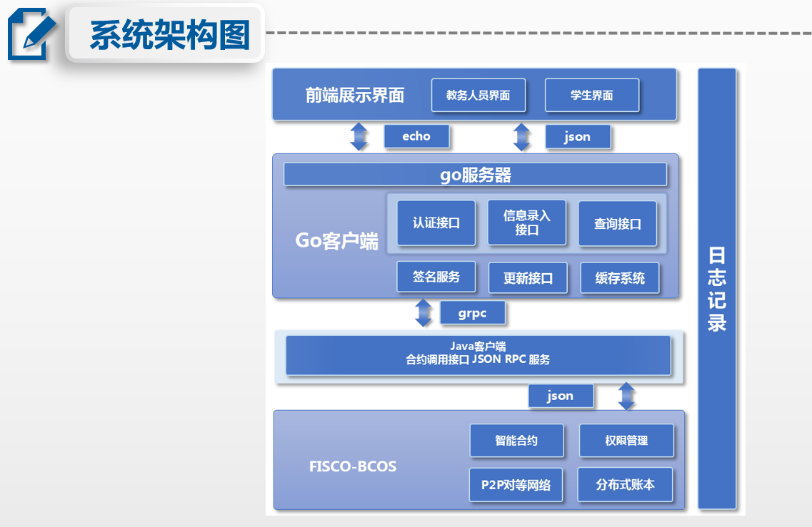
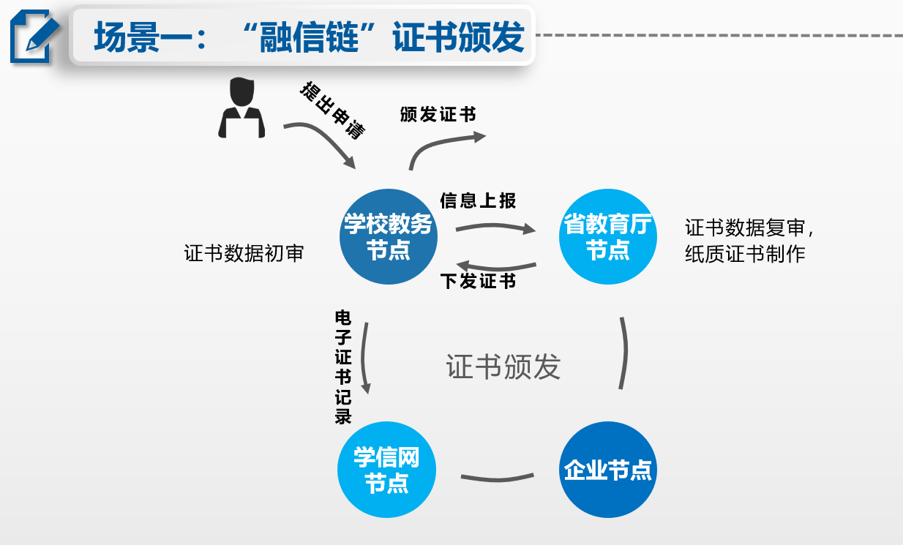
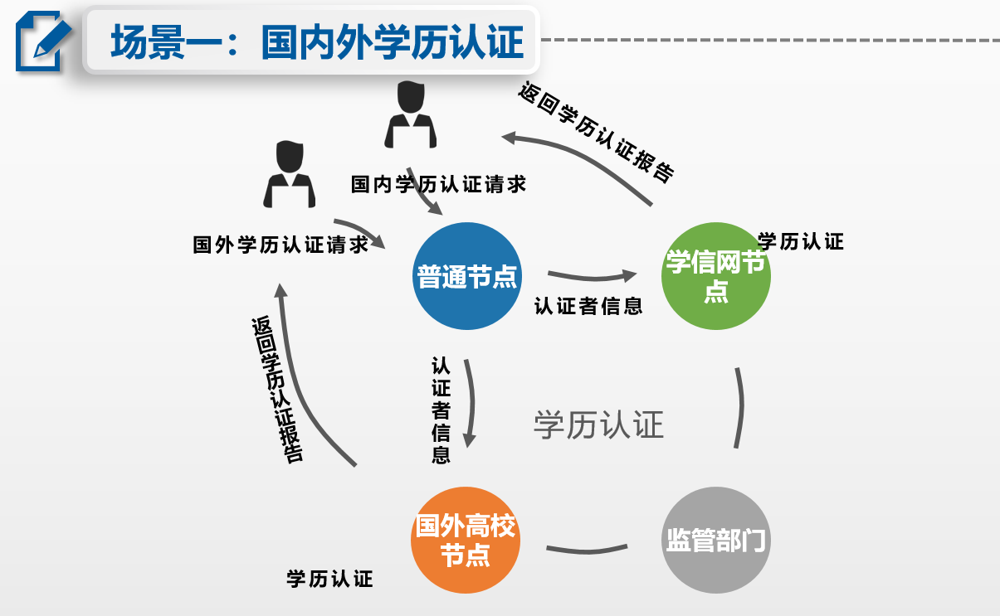
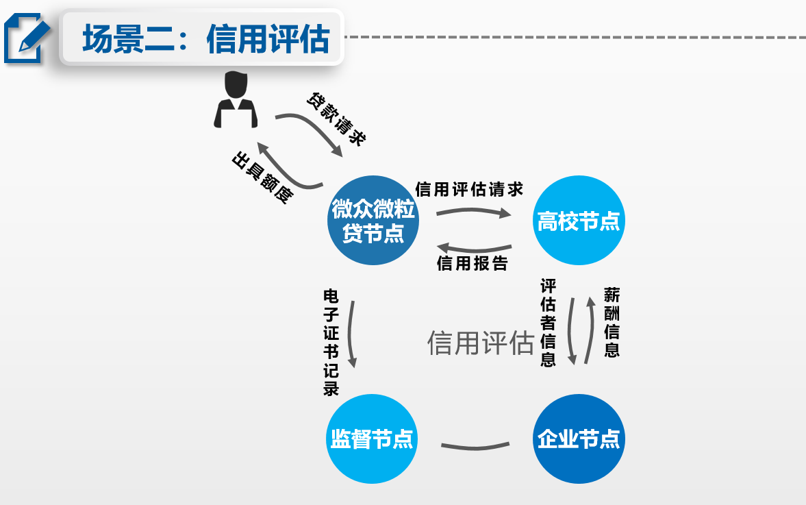
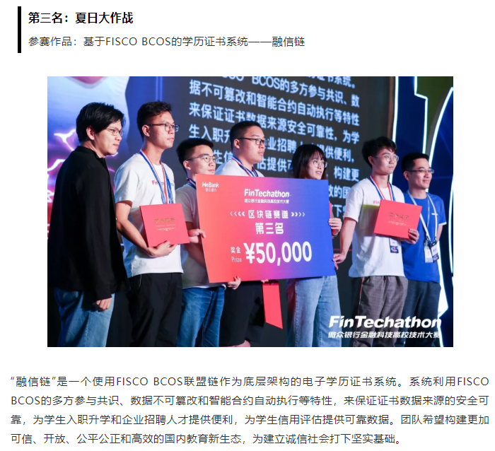

# 融信链
微众比赛的融信链项目，通过区块链赋能教育证书和诚信评估

### 1.项目背景

#### 1.1 社会发展与人才培养

​       改社会发展日新月异革开放以来，我国政治、经济、文化和和社会发展日新月异。随着国家经济发展进入新的阶段，政府机构和社会组织越来越需要大量高质量的人才。

#### 1.2 **学历教育** 

​       我国人才培养体系的基础和核心，因此以学位证书和学历证书为代表的各类文凭和证书在升学及就业中拥有了越来越重要的地位

#### 1.3 电子学历证书存在问题

- 证书真伪问题

证书数据和高校教务数据安全可靠性不可保证，相关部门缺少监管数据来源的通道等

- 评价维度问题

证书仅是教育部和学校颁发的学历或学位证明，无学生、企业等社会组织的参与，缺乏对学生能力的多维评价等

- 实时性问题

学历证书审核颁发、跨国学历认证难等场耗时长等

#### 1.4 区块链赋能教育

	“融信链”针对现有的电子学历证书系统存在的不足，用 `Fisco-Bcos`联盟链记录数据，保证学位学历证书数据来源可靠，公平公正记录学生在校学习经历，打开学校与社会各界开放交流的通道，为学生入职升学和企业招聘人才提供便利，提升跨国学历认证事务办理流程，最终提高教育质量，构建更加可信、开放、公平公正和高效的国际教育新生态。

#### 1.5 对存在问题的解决思路

- [ ] 证书真伪问题：关键数据上链
- [ ] 参与度问题：参与方共同建设“融信链”
- [ ] 实时性问题：智能合约简化流程

### 2. 程序使用和场景描述

##### 项目架构图是：

##### 场景一：

##### 场景二：

##### 项目具体实现：
本项目使用的编程语言有：Java、Go和Solidity

Java 端的使用，参见 lrxTest 目录下的介绍

Go后端的使用，参见 GoRXL 目录下的介绍

### 3. 商业价值和展望

#### 3.1 社会效益

西电教育改革试点，已与bcos达成合作，有校信息化处参与和校改基金支持，预计明年在西电上线，发布链上学历证书；

促进多维度电子学历证书系统的建设，作为区块链在教育界实际应用的试点，推进国际教育体系改革。

#### 3.2 经济效益

有偿信息查询：企业批量个性化查询需要支付一定费用；

微众银行作为联盟生态的一个节点，将“融信链”上沉淀下来的可信数据作为学生信贷、征信的依据。杜绝不良P2P校园贷，助力普惠金融。

### 4. 获奖展示

本作品用于参加微众银行举办的`首届金融科技高校大赛`，并获得三等奖名次。

##### 可以访问一下网站[了解详情](https://mp.weixin.qq.com/s?__biz=MzU5NTg0MjA4MA==&mid=2247485527&idx=1&sn=7f8351596f38fd0d95c50ad321836d89&chksm=fe6a8d18c91d040ececccb84e2d9400c24a5d233cf0f5bfe44b554b9085faa76518717280517&mpshare=1&scene=1&srcid=&sharer_sharetime=1568618790497&sharer_shareid=c8fa107db2039a2eddc7fabdb6a39c6b&key=a00a174091495fb1c8c39b05357aca51d28937f4ee95b6e0a22ed415bc5746256fad1b13c73264c73553c10640c97f3979d363da2e10191f0d4e1a748c2f9d6ea85f3feb5acce1f8725036e8baa1ab9d&ascene=1&uin=OTg2NTk3NTA2&devicetype=Windows+10&version=62060833&lang=zh_CN&pass_ticket=67jRHxzay8kNrF6b5oXOT%2F23BcbQFUEocIovv06kBzc%2FW6XuWGDX6p%2FV2Rdfpshf)

 