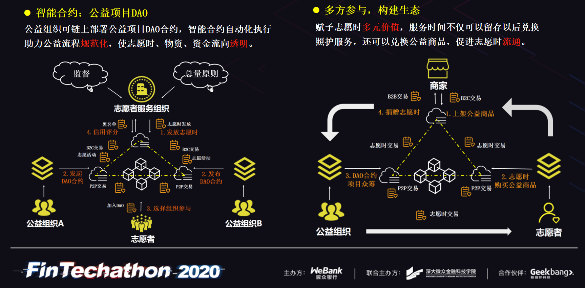

# 紫荆路航空团-时间银行区块链公益平台

## 项目简介

目前运行的时间银行项目多数使用传统单服务器Web架构，志愿时信息仅由单个网站存储维护，缺乏数据的多方认可，公信力不足，难以支撑数字资产的价值，志愿时流通性差。基于FISCO BCOS联盟链的时间银行可以改变已有的时间银行系统的架构，本质上是一种分布式架构，可以对志愿时数据进行分布式存证。多方参与记账、共识机制和哈希算法保证了数据的一致性与不可篡改，提供了数字资产价值的底层技术支撑。WeCross跨链技术提供可信数字资产跨链交换方式，可使不同同地区的时间银行联盟链交易志愿时，实现志愿时异地“通存通兑”业务。另外，在系统中使用双目标优化模型指导服务定价，有助于志愿者成本最小化和全局服务完成率最大化。

## 项目背景

当前中国社会老龄化程度不断加深，我国已有老龄人口达2.56亿，且有一半老人处于独居的状态。这些老人常年独居在家中很容易遇到危险，每年我国都会出现老人出现意外死亡后数日才被发现的事件。我们这个社会需要有人能作为志愿者来帮助这些独居老人。然而，当前志愿者服务制度缺乏配套的激励机制，志愿服务面临着热情难以维持、“简单的扎堆做，难的没人做”等问题。中国百名优秀青年志愿者—丛飞，从事公益11年之久，共资助186名贫困孩子完成学业，为之他家财散尽患癌症，但在他病危之时，无人伸出援手，甚至有人怀疑其作秀。对像丛飞这样这样长年从事公益，真心为善的人，社会应当有一种机制，在他们危难之时能够帮助到他们。

## 项目目标

我们的目标是通过时间银行来解决背景中提到的志愿者激励回馈制度问题。2018年在全国两会期间，有代表建议在在全国推广“时间银行”。对此，民政部宣布，已将“时间银行”纳入全国居家社区养老服务改革试点范围。民政部办公厅印发《关于推广使用全国志愿服务信息系统的通知》，明确要求以全国志愿服务信息系统数据为依据，完善志愿者评价与激励回馈制度等。时间银行提倡“服务今天，享受明天”，简单来说就是有能力的时为大家提供志愿服务，获取对应的志愿时，志愿时作为一种数字资产存入时间银行。在有需要的时候，就可以消费以前积累的志愿时，换取别人为自己服务。

 

## 方案

在时间银行，志愿者做志愿积累的志愿时是一种数字资产而不再是单纯只是一个数字，对志愿者可以形成价值认同和激励回馈。时间银行中的志愿时赚取和提现本质上都是一种交易，而区块链作为一种以交易作为有效状转换标志的的信息系统，对时间银行这种机制是天然支撑的。我们的方案是使用FISCO联盟链构建一个多方参与的平台，统一志愿者在各个公益组织的志愿数据。各公益组织负责记账，在记录其他组织数据的同时自身的志愿服务数据也能获得其他志愿组织的认可，在数据交换的同时将信任构建起来，实现数据互通，多方认可。以志愿时统一存证为基础，多方协作共同构建统一公益体系。

 

在这个过程中我们使用了WeCross的跨链技术。WeCross作为一种可信数字资产跨链交换方式，可使不同同地区的时间银行联盟链交易志愿时，实现志愿时异地“通存通兑”业务。可在不同地方提现志愿时，享受志愿服务，可异地养老或为在异地的父母服务。

 

另外，在系统中使用双目标优化模型指导服务定价，有助于服务对象的成本最小化和全局服务完成率最大化。 

我们还可以利用智能合约的许多特性，例如使用DAO合约来实现链上部署公益项目，以及志愿时兑换公益商品等，促进志愿时流通。

 