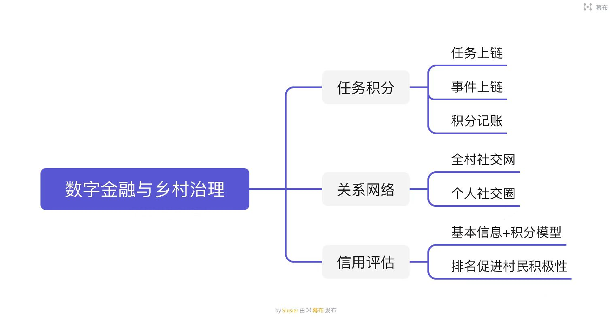

# 开拓者-数字金融与乡村治理

## 项目简介

“开拓者”项目是基于区块链可信大数据AI的下一代的“数字金融+农村社区”治理优化系统，通过将村庄居民的基础情况与行为分类，转化为积分等可以量化的信息，全部上链管理，对个体进行评价。主要包括三个方面：

- ①积分量化行为进行奖惩，区块链通证经济激励。并通过积分兑换和公式等方式对居民进行激励，鼓励向好。
- ②AI 社交网络，关键节点让治理更高效。居民的行为不仅用于转换积分，还可以被追踪记录，并呈现为社交网络图，方便居民对个人关系及村庄对居民进行管理。
- ③积分助力金融，可信大数据智能风控。积分还可以进一步计算以衡量居民个人信用，促进决策。

## 项目背景

- 2019年6月，中共中央办公厅、国务院办公厅印发《关于加强和改进乡村治理的指导意见》，并发出通知，要求各地区各部门结合实际认真贯彻落实。实现乡村有效治理是乡村振兴的重要内容。农村基层组织，村民自治。
- 2014 年 3 月银监会发布了《农村中小金融机构行政许可事项实施办法》，放宽了村镇银行准入门槛，为农户提供更便利的金融服务。2019 年中央一号文件提出，打通金融服务“三农”各个环节，建立县域银行业金融机构服务“三农”的激励约束机制。
农村小额信贷+农村保险

## 方案
- 居民首次注册后，在“我的”界面中，通过“信息填报”选项进行填报；然后通过发布/领取任务/建言献策进行事务求助或积分获取，与此同时还可以建言献策；居民的行为会连接其他人，据此会产生关系网络图，居民可以通过“我的-我的关系图”查看自己与其他人的关系密切程度；
- 此外，居民的基本信息和个人行为积分会被内部计算后得出信用积分，居民据此参加融资等活动。

## 团队成员

|作品名|参赛队员姓名|学校/公司名|
|-----|---------|----------|
|数字金融与乡村治理|蒲沧龙|浙江工业大学之江学院|
|数字金融与乡村治理|王宁波|无锡太湖学院|
|数字金融与乡村治理|江会文|江西师范大学|
|数字金融与乡村治理|罗智文|江西师范大学|
