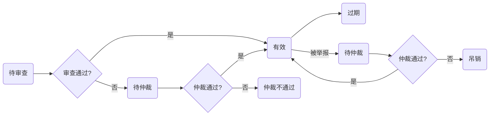
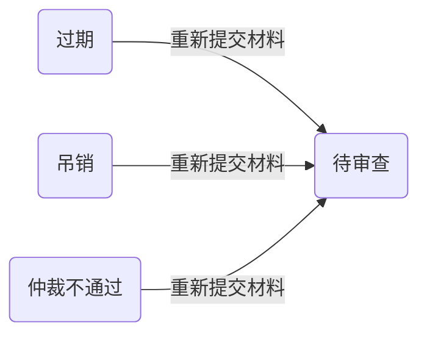

# 功能新增和修改

## 智能合约
### 报告审查合约 

随机选择审查实体后，展示出审查实体的机构名称和其公钥。

添加审查不通过功能，审查不通过后，进入仲裁流程

### 证书合约

新增证书状态：有效、过期、吊销、待仲裁、仲裁不通过、待审查

证书状态转移图：


都画在一起太乱了，分开画的，是这个意思就行。
### 安评师列表合约
安评师根据证书编号检索

安评师增加所属机构属性

增加报告撰写和审查日志功能

业务列表结构体：
```
业务列表 {
    时间
    证书地址
    业务类型：审查、评价
}
```
## 智能合约新增

### 身份管理合约 Management.sol 

功能：
```
1、企业上传公钥和基本信息，监管部门审核后选择通过或不通过。

2、存储所有监管部门列表 ，即监管部门账户列表

3、保存所有实体列表。
```
### 信用评价合约 Credit.sol

功能：
```
1、根据安评师的输入，通过某个公式给出一个信用分

2、通过安评机构的输入，计算所有安评师的个数和所有安评师信用分的平均值。
```
### 仲裁合约 Arbitrate.sol
功能：
```
1、随机选择三个监管部门 

2、收集监管部门仲裁结果

仲裁阶段若有一个监管部门否决，则”仲裁不通过“。若全部通过，则发证

举报阶段若有一个监管部门同意，则吊销该证书
```
## 最后
目前还是先把功能实现完，不考虑访问控制，功能测试完毕后，前端改代码阶段，再修改访问控制部分

修改函数和变量的命名方式。使用驼峰命名法，addBusiness这种，尽量让函数名对功能有一定解释。