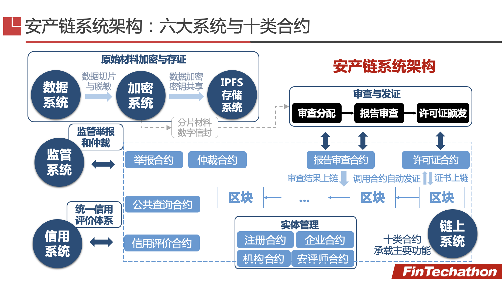
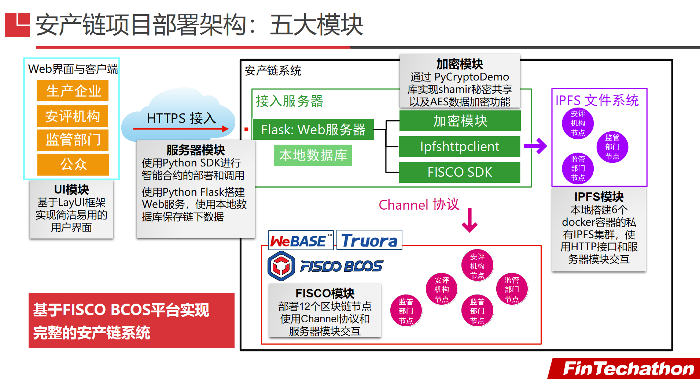

# 安产链

## 项目简介

安产链创新性地将**区块链和现代密码学**技术应用于安全生产领域，建立提供可监管隐私保护的分布式统一数据共享和信用体系，实现对安评过程的强制随机审查和精确到个人的细粒度精准监管，切实**解决安评行业“两虚假、两出借、监管难”三大痛点问题**，提供**可信、可靠、可监管的链上安全生产监督治理平台**，以区块链为武器维护人民群众的生命财产安全。

## 项目背景

近年来，安全生产事故频繁发生。在2020年，有近三万人死于生产安全事故，情况不容乐观。相关事故调查报告显示，监管缺失和安评造假往往是导致生产事故的重要原因。安评造假问题十分严峻，在今年开展的安评机构执业行为专项整治中，问题仍层出不穷。针对安评造假乱想，国家应急管理部多次开展安全生产专项整治活动。但集中整治只能起到暂时性的打击作用，无法提供长期持续和全覆盖的解决方案，不能从根本上治理安评乱象。

安全评价过程是安全生产管理中的重要环节。我国的现行政策规定，化工煤矿等高风险生产企业必须通过安全评价、获得安全生产许可证之后，才能投入生产。而安评过程的复杂性、专业性催生了由安评机构参与的安全评价体系。

这个体系中，由专业的安评人员组成的安评机构从监管部门获取评价资质后，可以为生产企业进行安全评价和出具安评报告；之后企业可以凭借安评报告向监管部门申请安全生产许可证。事实表明，这个体系中存在三大痛点问题：

1. ”两虚假”，指在安全评价过程中，企业出具虚假材料、安评机构出具虚假报告。
2. “两出借”，指评价人员出借资格证书（证书挂靠）、安评机构出借评价资质（资质挂靠）。
3. “监管难”，指集中监管成本高、公众监督举报难。

在现有体系下，由于没有可信存证、信息不透明、信息流通不顺畅、集中监管模式等原因，无法有效解决这三个痛点问题。因此安评乱象难以根治。虚假报告贻害无穷，将直接导致从源头防范化解风险变为从源头埋下风险，扰乱政府安全监管科学决策，影响企业本质安全水平，阻碍安评行业自身发展。对社会而言，安评造假严重损害社会公共秩序和公共利益，如若听之任之野蛮生长，无异于与“人民至上、生命至上”的宗旨背道而驰。因此，要铁腕治理安评机构造假问题，下猛药、动真格，坚决打击造假行为，维护经济社会安全健康发展。

## 项目目标

项目响应应急管理部在 2021 年 5 月开展的安评机构职业行为专项整治行动，基于区块链进行技术研发和产业创新，解决安评行业痛点问题，提供可信、可靠、可监管的链上安全生产监督治理平台。

我们希望项目的业务逻辑贴合行业实际，满足行业需求，具有实际应用价值和落地可行性，为加强安全生产提供帮助。

## 方案设计

借助区块链提供的分布式信任和可靠存储、智能合约提供的不可干预的执行过程，实现所需存证/审查/仲裁/分布式监管等能力，解决安评痛点问题。

* 针对**两虚假**问题，通过提供**不可篡改日志和强制审查机制**来保障精准追责和提高造假成本。

* 针对**两出借**问题，我们通过建立基于业务记录的**信用评价体系**替代原有的以数量评资质的方式来**使“挂证”成为无效操作**，从而解决出借问题。

* 针对**监管难**问题，我们建立**分布式**的**行业内互审计**机制和**基于智能合约的可信仲裁**来解决监管成本和举报难题，提高监管能力和效力。

通过整合上述设计，我们构建了由六大系统和十大合约组成的安产链系统。六大系统包括：数据系统、加密系统、IPFS存储系统、链上系统、信用系统和监管系统。其中数据系统、加密系统和IPFS存储系统承载数据处理和存储功能，信用系统和监管系统分别提供了信用评价和举报仲裁功能。链上系统由十类智能合约构成，包括：管理合约、企业合约、机构合约、安评师合约、报告审查合约、许可证合约、举报合约、仲裁合约、公众查询合约和信用评价合约。

我们基于 FISCO BCOS 平台以及提供的 WeBASE 和 Truora 中间件实现了完整的安产链系统。整个系统分为五个模块，覆盖了从用户接入到服务器处理到底层区块链系统的完整业务链条。基于 CALIPER 的压力测试结果表明，我们的安产链实现性能满足实际需求。

## 部署文档

我们文件夹的目录包括：

1. Contracts，包括了系统中的十大智能合约。其中 [接口文档](Contracts/ReadMe.md) 提供了智能合约的详细接口。
2. Projects，该文件夹包括了项目实现的完整源代码。安产链项目的部署文档位于 [部署文档](Project/ReadMe.md)

项目的具体部署方案请参阅 [部署文档](Project/ReadMe.md)。

## 开源协议

安产链项目使用  [GNU GENERAL PUBLIC LICENSE Version 3](Project/LICENSE) 开源协议开源。

