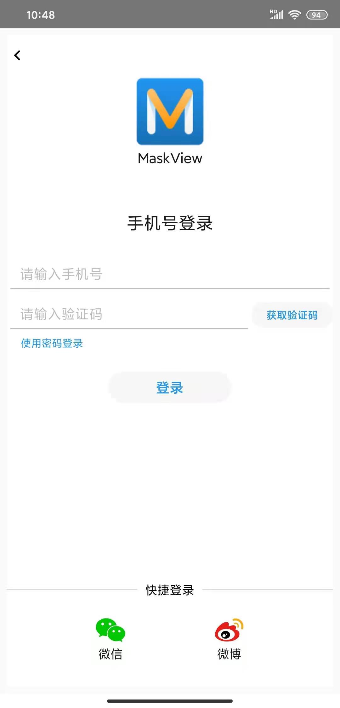
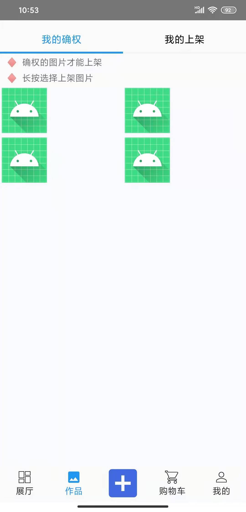
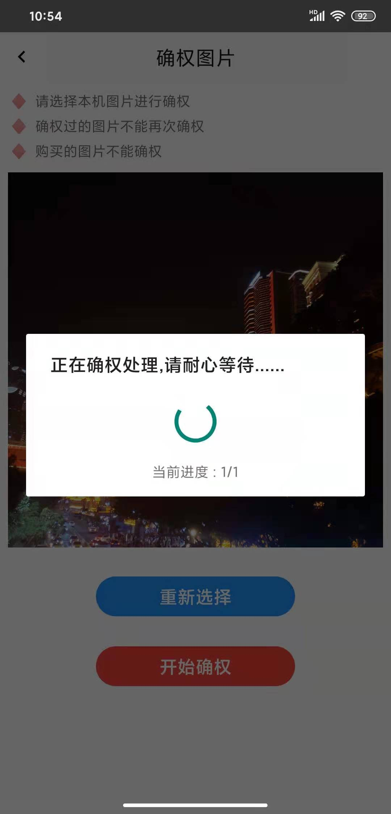
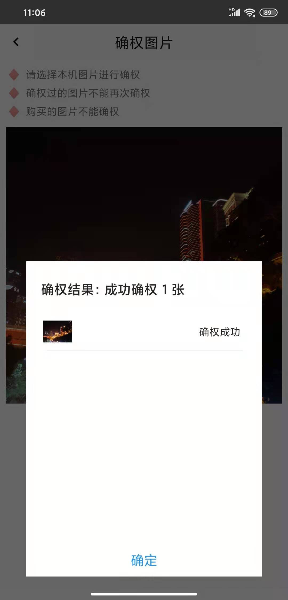
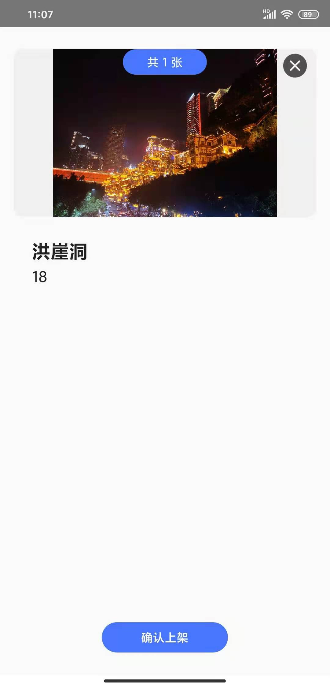
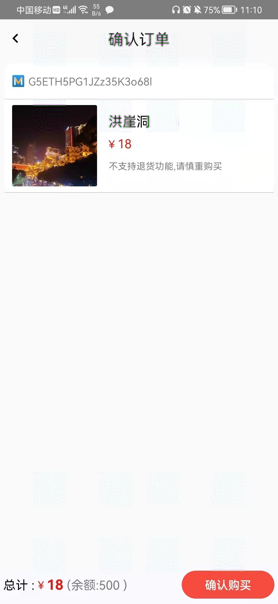
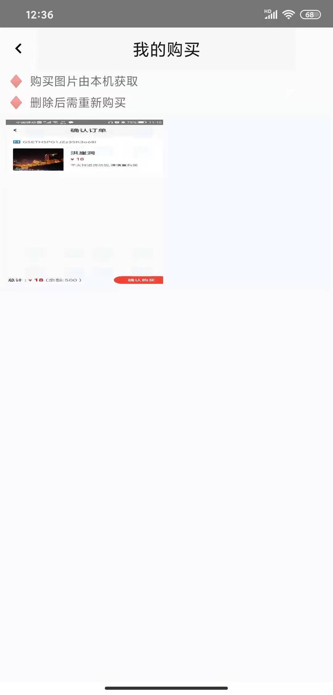

# MaskView操作手册

## 部署服务

在部署服务之前，需要修改各个代码中的配置。

### 修改配置

#### 1. 智能合约

首先，需要在区块链系统上部署我们写好的智能合约：`PointControllerClient.sol`，切换到控制台，部署合约：

```shell
部署，并修改智能合约的地址：
[group:1]> deploy PointController 
transaction hash: 0x2827cf823dce3cb3fc6543d89b042370f2be5d99fb2809a37f778d873888a7ae
contract address: 0x162da7a679bbe9d8015e6d4d32598ecb4f0966a8
```

之后，切入到Java代码中，找到对应目录，修改智能合约地址：

```shell
在目录下，com.media.bcos.client.PointControllerClient
修改部署合约的对应的地址
String contractAddress = "0x162da7a679bbe9d8015e6d4d32598ecb4f0966a8";
```

#### 2. Java端

由于Java服务器使用到了MySQL数据库，且需要连接到区块链，所以需要修改IP地址。

1. 修改MySQL数据库配置

```shell
找到目录文件：server-java\src\main\resources\application.properties

修改MySQL配置
# mysql8数据源配置
spring.datasource.driverClassName=com.mysql.cj.jdbc.Driver
spring.datasource.url=jdbc:mysql://IP:3306/starry
spring.datasource.username=用户名
spring.datasource.password=密码
```

2. 连接到区块链网络

```shell
找到目录文件：server-java\src\main\resources\applicationContext.xml

修改区块链配置
 <value>IP:20200</value>
导入对于区块链节点的证书
```

3. 短信服务

```shell
找到目录文件：com.media.utils.Constants

    // 短信服务
    public static final String SMS_REGION_ID = "ID0";
    public static final String SMS_ACCESS_KEY_ID = "密钥1";
    public static final String SMS_ACCESS_KEY_SECRET = "密钥2";
    public static final String SMS_REQUEST_DOMAIN = "URL";
    public static final String SMS_REQUEST_VERSION = "time";
    public static final String SMS_REQUEST_ACTION = "服务";
    public static final String SMS_SIGN_NAME = "机构";
    public static final String SMS_LOGIN = "ID1";
    public static final String SMS_REGISTER = "ID2";
```

3. 启动命令：

```shell
java -jar xxx.jar
```

#### 3. 安卓端

由于安卓客户端需要和Java服务器通信，需要修改对应的IP地址：

1. 和Java服务器通信

```shell
找到目录文件：MaskView\app\src\main\java\com\xdlr\maskview\util\GetIP.java

修改和Java端通信的IP地址：
 	public static String myIP() {
        return "https://IP:718";  // 云服务器
        //return "https://10.0.2.2:718";  // 本机
    }

    public static String javaIp() {
        return "https://IP:1718";  // 云服务器
        //return "https://10.0.2.2:1718";  // 本机
    }
```

2. 和 `Nginx` 通信

```shell
找到目录文件：com.maskview.util.UtilParameter

修改显示照片url的ip：
public static final String IMAGES_IP = "http://IP/";  // 云服务器
```

#### 4. Nginx

对图片的访问，使用`nginx`进行加速访问。

```shell
nginx -s stop  关闭
nginx -c /etc/nginx/nginx.conf 启动
```

其配置主要是：

```nginx
		location  /img/ {
            root /root/maskview/starry/;
            autoindex on;
        }
        
        location  /thumbnailImg/ {
            root /root/maskview/starry/;
            autoindex on;
        }

        location /base64File/ {
            root /root/maskview/starry/;
            autoindex on;
        }	
```

### 部署启动

切换到Java端，执行：

```shell
java -jar XXX.jar
```

切换到android studio ，执行：

```shell
build 
找到对应的APP，安装到手机
```

备注：可云端部署

```shell
##根据端口port查进程：
lsof  -i:port     
##查找特定的进程
ps -ef|grep ssh
##不挂断运行命令,当账户退出或终端关闭时,程序仍然运行，所有输出被重定向到Log.log的文件中
nohup 执行命令 >> Log.log &
```

## 进入系统

### 1. 注册和登陆

登陆：

<div  align="center">

</div>


### 2. 确权和上架

点击作品；

点击“我的确权”，可开始确权：

<div  align="center">

</div>


点击“+”，选择需要确权的图片：

<div  align="center">

</div>

等待，嵌入水印：

<div  align="center">

</div>

确权成功后：

<div  align="center">

</div>


确权后，需要上架，只要上架后的商品才能被看到：

<div  align="center">

</div>

点击“上架”

### 3. 交易

点击商品，加入购物车：

<div  align="center">

</div>

点击购买，需要等待2分钟左右

在“我的购买”中可以看到信息：

<div  align="center">

</div>