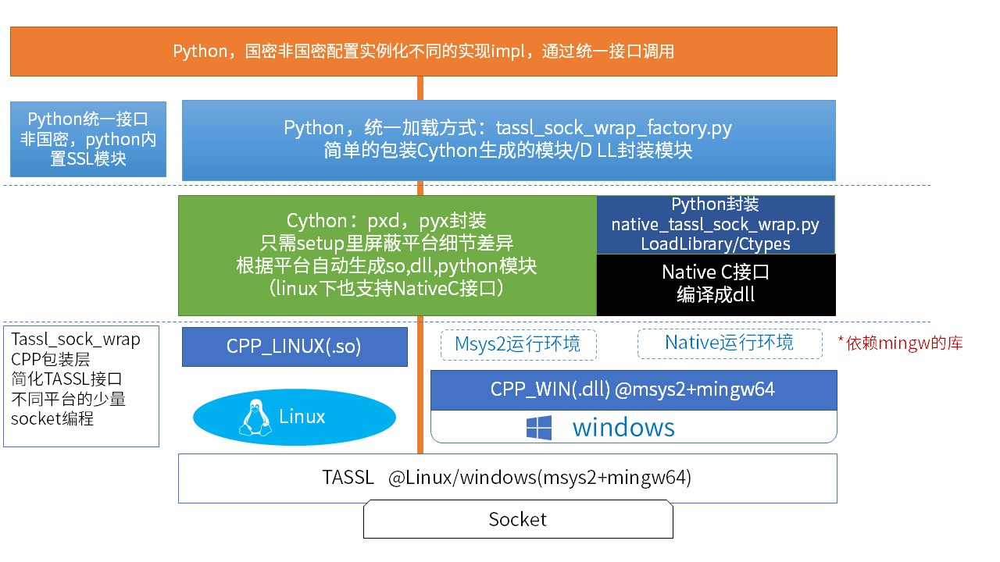

# python_tassl_wrap
为python语言包装国密的tls/ssl实现，包括cpp动态库，cython封装，测试代码等

### 总体结构说明

最底层依赖TASSL库，用c风格在不同操作系统平台上封装，代码差异主要在对socket编程上，linux平台和windows平台的socket编程略有不同。

> 两个平台编译出来的对TASSL的封装库，都是 libtassl_sock_wrap.so/dll

和python桥接部分，在linux上直接采用cython封装，比较直观。同时也实现了native c库和python ctypes调用

在windows上，因开发环境使用的是msys2+mingw64,和msvc编译环境不兼容，所以：

>1)在msys2+mingw64环境运行，同时可支持cython封装和native的dll调用（直接LoadLibrary）
>
>2)在非msys2环境，如windows的cmd控制台下，因编译连接不兼容，msys2里编译的cython模块无法加载，
所以提供python直接加载dll的调用模式（native_tassl_sock_wrap.py)，两种模式的加载已经在client/tassl_sock_wrap_impl.py里封装过。


如图:


* 以上均为64位系统和环境，包括linux，windows（10），mingw64，python 64位版本。未在32位系统里测试，不能混用python 32位版本。需全面64位化。

### 目录结构

本目录 *.pxd,*.pyx为cython封装

**sdk** : 开发测试时可以将 fisco bcos的国密sdk证书复制到此目录。测试代码加载证书的路径固定指向这个目录。一共应有五个证书

**cpp_linux**: cpp封装代码，linux centos7平台支持,支持被cython封装调用

**cpp_win**: cpp封装代码，windows平台支持，在msys2+mingw64上编译，以支持cython和dll调用模式

**test** : 一些示例

### 脚本列表

**build_all.sh**: 编译cpp和cython扩展，会自动判断平台，进入cpp_linux或cpp_win编译

**exe_setup.sh**:  带环境变量和参数执行setup*.py,对应python setup*py xxx yyy命令

**clean.sh**:  清理目录

**run_tassl.sh**:  执行cython库测试

**deploy_tool.py**: 便捷的将相关依赖库部署到python-sdk根目录下，和console.py等平级，便于运行体验

* 测试时，在当前目录下建一个server.ini文件，写入一行[ip:port]，如 119.88.88.88:20201，作为测试节点的网络地址，否则默认使用127.0.0.1:20200
----------------------------------

### 准备 cython环境

以下命令都可以

>apt-get install Cython 
> 
>yum install Cython
>
>pip install Cython

----------------------------------

### 准备TASSL环境

1. 获取TASSL代码：git clone https://github.com/jntass/TASSL (或gitee镜像)

2. 进入TASSL目录，config 

> 注意用shared选项生成动态库
> 
> ./config shared
>   
>make clean ；make ；make install

此刻应在TASSL目录下生成libssl.so,libcrypto.so 等文件。

* 在window上，则是生成 ssleay32.dll，libeay32.dll等文件

(todo: TASSL是否应编译成特定的名字，如libtassl.so,目前是默认的libssl.so)

是否安装TASSL的库到系统路径，取决于实际环境和需求。

3. 编辑环境变量，如~/.bash_profile,增加 

```bash
export TASSL=[实际的TASSL目录，需要检索头文件，lib库等]

export LD_LIBRARY_PATH=$LD_LIBRARY_PATH:./:$TASSL

export LD_LIBRARY_PATH=$LD_LIBRARY_PATH:[python-sdk或运行目录下能找到cython封装库和libtassl_sock_wrap.so/dll，运行依赖库的目录]

如export LD_LIBRARY_PATH=$LD_LIBRARY_PATH:[python_sdk目录]:[python_sdk目录]/cython_tassl_wrap:[python_sdk目录]/cython_tassl_wrap/cpp_win:[python_sdk目录]/cython_tassl_wrap/cpp_linux

```
并确认环境变量生效

* 用cython库封装模式运行时，libtasll_sock_wrap.so/dll以及相关运行库可能需要在当前运行目录下，取决于系统环境参数配置情况。

* 在windows平台上，基于msys2环境编译出来的库，其系统级依赖库在cython_tassl_wrap/cpp_win/mingw64_rt_lib目录下，如报告找不到库，可以将此目录下的dll复制到运行目录下

----------------------------------

### 编译安装cython_tassl_sock_wrap封装库

1: 运行./build_all.sh, 编译cpp_linux或cpp_win目录下的c++代码，生成测试程序和动态库。可用./run_tassl.sh运行测试

2: 本地模式:将生成libtassl_sock_wrap.so/dll复制到python_sdk的运行目录,进入cpp_linux或cpp_win：cp [*so/dll] ../../

即可回到python_sdk目录，运行控制台等

*运行前可使用`ldd *.so/dll`确认动态库是否正确连接到指定的TASSL动态库【重要】*

运行python-sdk 控制台前，修改client_config.py，包括

> 确认国密证书路径（一共有五个)
>
> 确认 crypto_type = "GM"和ssl_type="GM"，代表采国密通信模式

3: 安装模式，参考setup_*.py文件，[todolist]

--------------------------------------------

### msys2环境搭建
在windows环境上，MSYS2是MSYS的一个升级版,集成了pacman和Mingw-w64的Cygwin升级版, 
提供了bash shell等linux环境（仿真）、版本控制软件（git/hg）和MinGW-w64 工具链（来自[百度百科](https://baike.baidu.com/item/MSYS2/17190550))

官网:[https://www.msys2.org/](https://www.msys2.org/)

配置加速镜像：

> 编辑 /etc/pacman.d/mirrorlist.mingw64 ，在文件开头添加：
> 
>Server = https://mirrors.tuna.tsinghua.edu.cn/msys2/mingw/x86_64
>
>编辑 /etc/pacman.d/mirrorlist.msys ，在文件开头添加：
>
>Server = https://mirrors.tuna.tsinghua.edu.cn/msys2/msys/$arch
> 
>然后执行 pacman -Sy 刷新软件包数据即可。
>
>pacman -S mingw-w64-x86_64-gcc mingw-w64-x86_64-cmake mingw-w64-x86_64-make mingw-w64-x86_64-pkg-config 
>
>升级核心包: pacman -S --needed filesystem msys2-runtime bash libreadline libiconv libarchive libgpgme libcurl pacman ncurses libintl, 之后需要关闭所有 MSYS2 shell，然后运行 autorebase.bat

* 谨建议对linux风格有偏好的使用，考虑兼容和稳定性，建议安装配置MSVC开发环境，并将cpp_win下的各代码加入到MSVC的项目，参考Makefile进行编译设置。
* 本项目全程在msys+mingw64下编译开发，暂时不另外提供MSVC工程，欢迎开源贡献.

### 运行库部署工具
当环境一切就绪，且成功执行 build_all.sh后，应生成了运行时库，包括TASSL的cpp封装库，cython封装cpp的库。

对windows(10)和linux centos7，本项目还内置了编译好的TASSL、以及系统级运行时库，分别参见 cpp_linux/cpp_win下的"runtime_libs_[平台]"目录

采用deploy_tool.py可便捷的将各运行时库复制到pyton-sdk根目录下（默认为当前的上级目录），或者清理已经部署的库文件（不删除其他无关文件）
```bash
./deploy_tool.py  deploy  [python-sdk path]:  deploy runtime libs to target dir
./deploy_tool.py  clean   [python-sdk path]:  clean  runtime libs from target dir
./deploy_tool.py  check   [python-sdk path]:  check  runtime libs for deploy
./deploy_tool.py  help/usage/? : print usage
default python-sdk target dir: ../

```
* 该部署工具还需要在多平台上测试确认，目前内置的库，仅为最小可用，不保证在所有不同系统上可用
--------------------------------------------
### 以下为开发笔记

目前进展：已经为python语言封装了TASSL库的几个关键接口，使python sdk可以通过国密tls连接节点，实现全流程国密化。

要点：

1： 使用TASSL :https://github.com/jntass/TASSL

2： 针对TASSL编写简单的c/cpp包装代码。

3： 用cython（http://docs.cython.org/ ）将c/cpp代码对接到python 

4： 采用pure c封装dll库的调用，再用python ctypes结合pure c接口，代替cython的桥接模块。封装见native_tassl_sock_wrap.py文件。

5： 对cython和pure c不同封装库的加载，封装在tassl_sock_wrap_factory.py里，可以屏蔽掉细节：

>首先尝试加载cython封装，如无法加载 ,则切换到pure c库模式
> 
>>* 首先在当前目录下试图打开pure c的封装:libnative_tassl_sock_wrap.so或dll
>>* 如失败 -> 尝试检索cython_tassl_wrap目录，
>>* 然后再根据平台检索cython_tassl_wrap下的cpp_linux或cpp_win子目录


1) TASSL

如果不做代码和安装上的优化，则完全不用修改这个库本身，用就行了。
面向TASSL写了test_tassl.c的测试代码，可以全程跑通加载国密证书，和节点握手，进行通信的整个过程。

调试test_tassl.c的坑主要是BIO系列的api，尤其是BIO_do_handshake/BIO_write在当时环境不生效，导致莫名的握手失败。改用SSL_do_handshake/SSL_write则一次通过（注，TASSL封装了握手全过程，其实使用时无需操心）。
一个小坑：因为最终TASSL要作为动态库被python调，而它默认编译时不生成动态库，要执行 ./config 时增加参数 shared：
./config shared
make clean ；make ；make install


2) C/CPP封装代码

C代码见test/simplessl,仅作为示例，以确认TASSL可用

CPP代码见cpp_linux或cpp_win目录下的tassl_sock_wrap.cpp  test_tassl_sock.cpp

都很简单，最小功能集只用到SSL的初始化，加载证书，连接，握手，写/读等有限的接口。

当前版本保持最小化实现，pure c with class风格，尽量不用动态内存分配，new 内存buffer等，暂时没有必要。


后续增加更多选项接口，以及错误处理等。


3) 重点：cython

安装 pip install cython
相关的多语言包装器有很多个，包括SWIG,pybind11,Boost.Python等。选择cython全靠缘分，没有做深入比较，反正只是简单的胶水代码封装，都够用，没时间去纠结。

使用cython支持cpp->python只有简单的几步:

1：写一个后缀名为pxd的文件，映射到cpp 的class定义，基本上直接copy cpp的文件就差不多了。

2：写一个后缀名为pyx的文件，引用pxd里的定义，封装为python类，这里面可以使用一些类c/cpp的语法糖，相当于python语言的cpp超集。

3：写一个setup文件，编译它的时候要指定头文件和库文件目录。参见run_tassl.sh

参考：https://cython.readthedocs.io/en/latest/src/userguide/wrapping_CPlusPlus.html cython和cpp整合专题。


但引用一些别人做好的案例模板，顺利的话，全套1小时以内就搞完了，高级语法再慢慢看。参考py_tassl_sock_wrap.pxd/pyx, setup_tassl_sock_wrap.py, run_tassl.sh等几个文件。很简单，再增加其他接口直接copy这几个文件或在里面加料即可。

编译时改的最多的bug居然是print/prinf，双引号单引号，有没有行末分号;等，混合编程最大的问题是语法混淆...


4) todolist:

优化部署运行体验，去除多余打印，测试稳定性(尤其是长连接多线程等场景)，完善错误处理，增加日志...等

