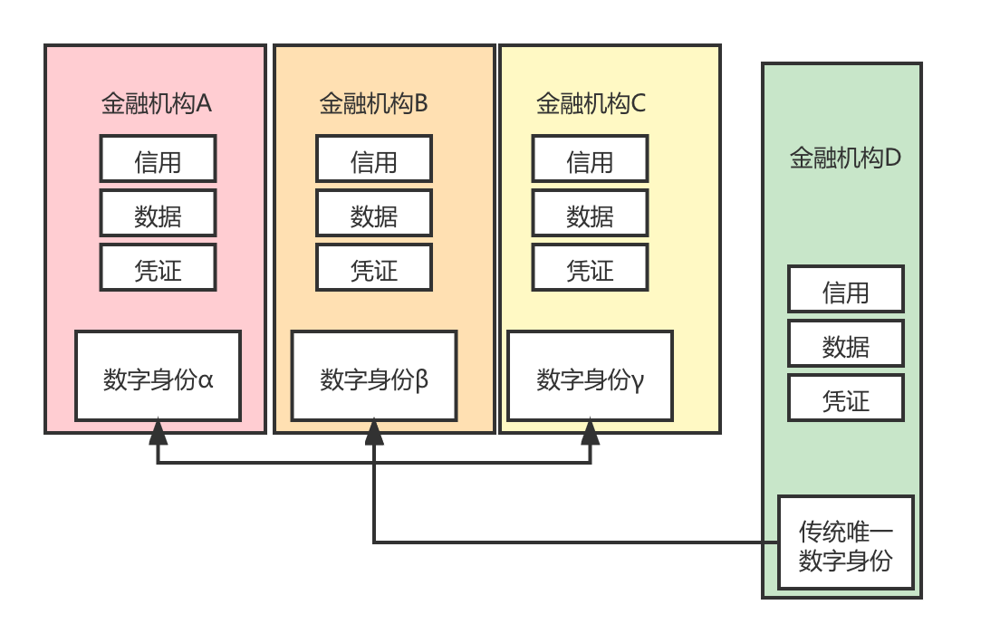
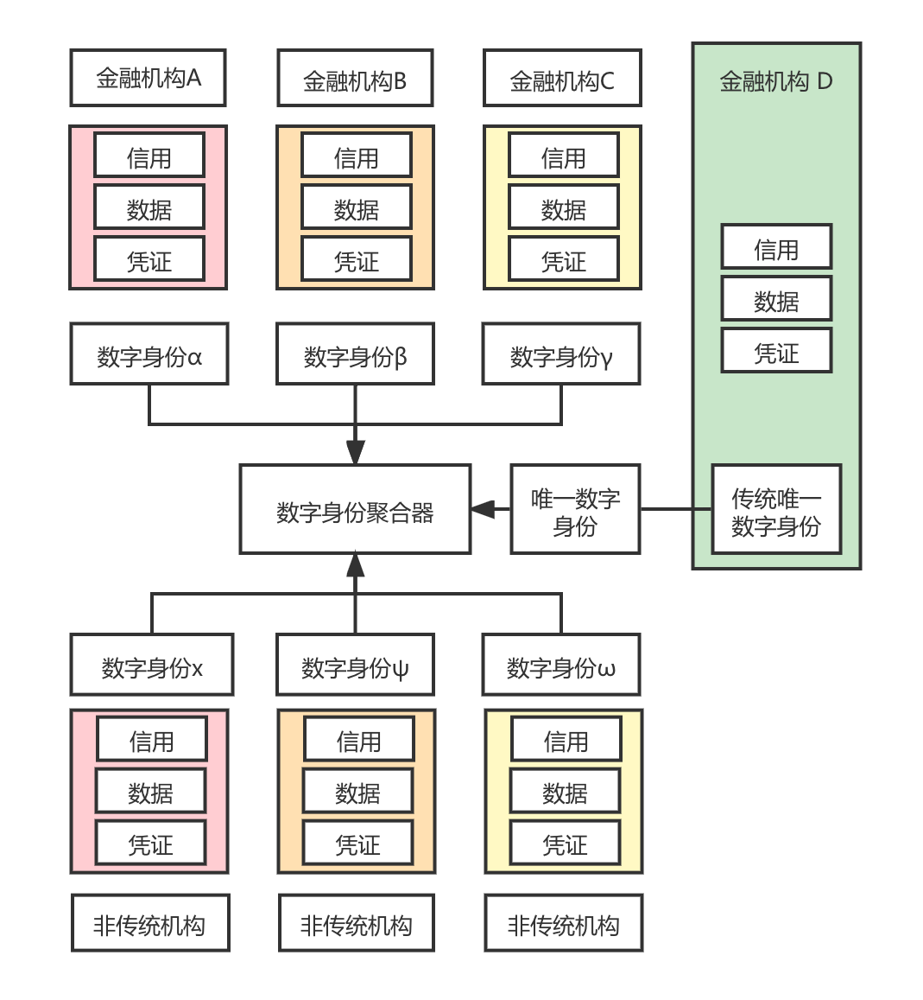
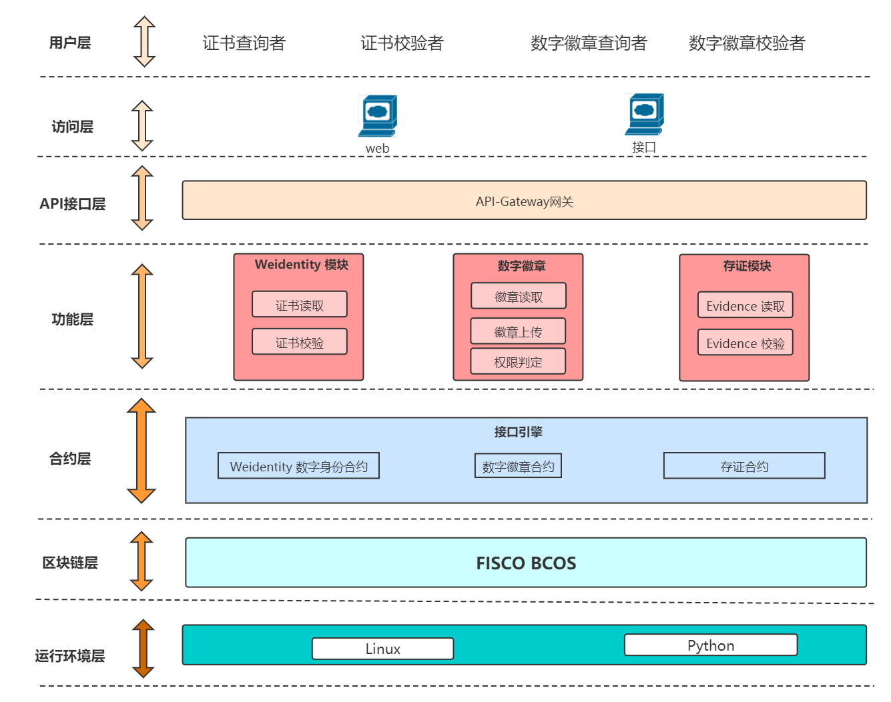

# 结合数字徽章的交互式区块链证书 DApp

## 1 项目简介

DID 与 VC 一直是区块链研究的重要领域，也是区块链落地的重要基础，从「传统证书」到基于DID的VC证书是证书体系范式转移的重要第一步。
但是，在迈出第一步之后我们可以进行更加丰富的尝试，例如尝试将不可转移的徽章与可转移的权益与证书相结合，从而赋予证书更加丰富的价值内涵，更好地服务于真实业务场景。

## 2 项目亮点

- 探索了更开放的数字证书体系的可能性
- 探索用户对自己数字身份和证书的自治在金融场景中的应用
- 在证书方面，用多方共治去代替原有金融机构的一方独治

- 我们也长期围绕 Weidentity 做了一系列的生态探索，有现有组件的优化，也有新组件的研发。未来也会长期参与到 Weidentity 及其他 BCOS 生态的建设当中。

## 3 项目背景

### 3.1 传统金融体系下的「数字身份、凭证、信用、数据 」

1. 身份、数据、凭证与信用等信息所有权都是属于金融机构的
2. 用户并非自己信息的主人
3. 无法在自主意愿下将A金融机构的信用在B金融机构使用
4. 金融机构间或许有信息的传递仅仅是机构间行为
5. 信用和凭证仅能由权威金融机构给出。即使用户在某个非权威金融机构中，如在 FISCO BCOS 社区中有很强的信用，这种信用是无法纳入到这个体系中来的

### 3.2 基于区块链的新金融体系下的「数字身份、凭证、信用、数据」

1. 个人有权拿到他的所有信用、数据与凭证，并有权自行处置，例如共享给自己信任的机构
通过分布式数字身份与可验证数字凭证技术，用户与机构可以在不经过中介的情况下完成点对点（P2P）的交互，如验证用户证书真伪
2. 由于数字身份开放的特性，非传统机构也能参与到身份信用的共建中来，扩充了个人数据的内涵，个人数据类型更加多样丰富
3. 被用户完全掌控在手中的数字身份聚合器成为连接各个数字身份的中心节点
注意！这种新的体系并非要替代旧的体系，而是和旧的体系可以保持兼容，通过低耦合的方式连接到传统的体系中。因此，新体系是涵盖旧体系的父集。

### 3.3 数字徽章

数字徽章和数字证书不同。数字证书只是由权威发行者签名的证书，本身不必上链，上链的是证书摘要和关联数据。数字徽章则完全是链上主体。结合数字徽章，数字证书中可以融入具体的权益，数字证书具备了更加丰富的价值，也具备了更加多样性的玩法。

## 4 项目目标

将不可转移的徽章与可转移的权益与证书相结合，从而赋予证书更加丰富的价值内涵，更好地服务于真实业务场景。

## **5 方案**

携带数字徽章的可验证证书应用（Verifiable Credential with Badges DApp）是一个 基于 Vue 框架的 DApp，主要功能包括：

- 证书的校验

- 证书的读取
- Crypto Badges 的读取与显示
- 证书中的Badges的读取与显示
- NFC 徽章扫码
- 可转移徽章与不可转移徽章的判定

## 6 一个例子

通过一个典型的例子，来理解我们这次项目的流程

1. 数字徽章提供机构（如麦当劳）、证书发放机构（如招商银行）均向管理委员发起身份验证，管理委员审核后将这些机构登记为通过认证的机构。
2.  数字徽章提供机构和证书发放机构达成合作
3. 证书发放机构向普通用户发放证书（如信用等级证书）时，附带数字徽章，包括可转让数字徽章（如麦当劳白金卡）和不可转让数字徽章（如招商银行十年优质用户）
4. 在有需要时，普通用户向证书校验者出示数字证书。数字证书可通过本系统或公钥列表验证证书的有效性与其中数字徽章的有效性

5. 在有需要时，普通用户也可以向其它任意用户转让其可转让的数字徽章。转让后，该徽章在该证书内失效，呈灰色不可用状态
