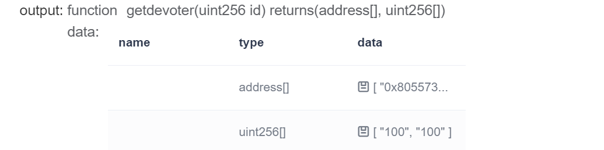

# WeHeart - 合约接口说明文档

---

## *合约列表* ：

- **`Individual.sol`**

  > 合约简介：个人用户合约
  >
  > 主要功能：
  >
  > - 爱心捐赠
  > - 求助申请
  > - 查询信息
  > - 资金溯源
  > - 积分转让
  >
  > 合约依赖：
  >
  > - **`Program.sol`**
  > - **`Integral.sol`**

- **`DAG.sol`**

  > 合约简介：DAG合约
  >
  > 主要功能：溯源搜索

- **`Organization.sol`**

  > 合约简介：机构用户合约
  >
  > 主要功能：
  >
  > - 发布项目
  > - 调整项目
  > - 资金溯源
  > - 信息查询
  >
  > 合约依赖：
  >
  > - **`Program.sol`**
  > - **`DAG.sol`**

- **`CallRingSig.sol`**

  > 合约简介：环签名合约
  >
  > 主要功能：
  >
  > - 验证身份
  > - 环签名信息生成与获取
  >
  > 合约依赖：
  >
  > - **`RingSigPrecompiled.sol`**

- **`Program.sol`**

  > 合约简介：项目合约
  >
  > 主要功能：
  >
  > - 存储爱心项目信息
  > - 为个人和机构合约提供依赖

- **`Integral.sol`**

  > 合约简介：积分合约
  >
  > 主要功能：
  >
  > -  积分交易
  > -  信息查询

- **`Table.sol`**

  > 合约简介：数据表合约
  >
  > 主要功能：数据存储与过渡

- **`CharityTable.sol`**

  > 合约简介：数据表操作合约
  >
  > 主要功能：对数据表进行增改查等操作
  >
  > 合约依赖：
  >
  > - **`Table.sol`**

- **`RingSigPrecompiled.sol`**

  > 合约简介：环签名预编译合约
  >
  > 主要功能：预编译合约
  
- **`WeHeartIdentity系列合约`**

  > 合约简介：公益履历系列合约
  >
  > 主要功能：
  >
  > - 记录、更新政府、机构和个人签名与cpt信息
  > - 政府给机构进行签名认证
  > - 个人参与项目
  > - 机构根据个人项目参与情况按照规范生成凭据
  
  - **`CptController.sol`**
  - **`CptData.sol`**
  - **`DataBucket.sol`**
  - **`Evidence.sol`**
  - **`EvidenceContract.sol`**
  - **`EvidenceFactory.sol`**
  - **`GovernmentController.sol`**
  - **`GovernmentData.sol`**
  - **`OrganizationController.sol`**
  - **`OrganizationData.sol`**
  - **`RoleController.sol`**
  - **`SpecificIssuerController.sol`**
  - **`SpecificIssuerData.sol`**
  - **`WeIdContract.sol`**

---

## *1.  Individual.sol*

- *主要数据结构*

  ```
  	Program  private _program;
      Integral private _integral;
      constructor(
          address Programaddr,
          address Integraladdr){
              _program =Program(Programaddr);
              _integral = Integral(Integraladdr);
      }    
      struct donate{     
          /*
          store the donation information
          */
          uint256 programID;
          string programType;
          uint amount;
          string message;
      }
          /*
          store the donation IDs and information
          */ 
      mapping(address => bytes32[]) _donationids;       
      mapping(bytes32 => donate)  _donationinf;         
      
  ```

  

- *addprogram*

  > 主要功能：发布新项目
  >
  > 参数列表：
  >
  > - `totalneed`
  > - `title`
  > - `programType`
  > - `description`

- *changevalue*

  > 主要功能：修改项目预筹集金额
  >
  > 参数列表：
  >
  > - `id`
  > - `_value`

- *dealPoints*

  > 主要功能：转让爱心积分
  >
  > 参数列表：
  >
  > - `_to`
  > - `_value`

- *devote*

  > 主要功能：进行捐赠
  >
  > 参数列表：
  >
  > - `id`
  > - `_value`
  > - `_programType`
  > - `_message`

- *getBalance*

  > 主要功能：获取账户积分余额
  >
  > 返回值：
  >
  > - `_integral.getBalance(msg.sender)`

- *getdonation*

  > 主要功能：获取该账户捐赠的项目
  >
  > 参数列表：
  >
  > - `_txid`
  >
  > 返回值：
  >
  > - `_txid`
  > - `_donationinf[_txid].programID`
  > - `_donationinf[_txid].programType`
  > - `_donationinf[_txid].amount`
  > - `_donationinf[_txid].message`

- *getdonationids*

  > 主要功能：获取所有捐赠ID
  >
  > 返回值：
  >
  > - `_donationids[msg.sender]`

- *getinfor*

  > 主要功能：获取项目信息
  >
  > 参数列表：
  >
  > - `id`
  >
  > 返回值：
  >
  > - `_program.getinfor(id)`

- *getprocess*

  > 主要功能：获取项目进展流程信息
  >
  > 参数列表：
  >
  > - `id`
  >
  > 返回值：
  >
  > - `_program.getprocess(id)`

- *getprogram*

  > 主要功能：获取该账户发布的项目
  >
  > 返回值：
  >
  > - `_program.getprogram(msg.sender)`

- *getstringinfor*

  > 主要功能：获取项目名称、类型和描述
  >
  > 参数列表：
  >
  > - `id`
  >
  > 返回值：
  >
  > - `_program.getstringinfor(id)`

- *getTxInfor*

  > 主要功能：获取交易明细
  >
  > 参数列表：
  >
  > - `id`
  >
  > 返回值：
  >
  > - `_integral.getTxInfor(id)`

- *getTxs*

  > 主要功能：获取积分索引
  >
  > 返回值：
  >
  > - `_integral.getTxs(msg.sender)`

- *implementProgram*

  > 主要功能：提交项目进展信息
  >
  > 参数列表：
  >
  > - `id`
  > - `_describe`

- *操作截图*

  - *合约部署*

  

  - *进行捐赠*

  

  - *获取已发布项目*

  

  - *获取账户积分余额*

  

  - *获取项目信息*

  

  - *获取项目描述*

  

  - *资金溯源*

  

---

## *2.  DAG.sol*

- *主要数据结构*

  ```
  /*
      store the parent programs and children programs and the consumed ids
      */
      mapping(bytes32 =>  uint256[]) internal Parents;  
      mapping(bytes32 =>  uint256[]) internal Children; 
      mapping (uint256 =>bool) internal _consumedIds;   
      event Commit(uint256 Id, bytes commitMessage);
      uint256[]  internal _parentTokenIds;
      uint256[]  internal _childrenTokenIds;
      uint256[]  internal commitBlockNumber;
  ```

  

- *getblocknumber*

  > 主要功能：获取区块高度
  >
  > 参数列表：
  >
  > - `id`
  >
  > 返回值：
  >
  > - `commitBlockNumber[id]`

- *getchildren*

  > 主要功能：获取子项目
  >
  > 参数列表：
  >
  > - `commitHash`
  >
  > 返回值：
  >
  > - `Children[commitHash]`

- *getCommitHash*

  > 主要功能：获取交易hash值
  >
  > 参数列表：
  >
  > - `id`
  > - `number`
  >
  > 返回值：
  >
  > - `sha256(id,number)`

- *getparents*

  > 主要功能：获取父项目
  >
  > 参数列表：
  >
  > - `commitHash`
  >
  > 返回值：
  >
  > - `Parents[commitHash]`

- *操作截图*

  - *合约部署*

  

---

## *3.  Organization.sol*

- *主要数据结构*

  ```
      Program private _program;
      DAG private _DAG;
      constructor(
      address Programaddr,
      address DAGaddr){
          _program =Program(Programaddr);
          _DAG = DAG(DAGaddr);
          }
  ```

  

- *addprogram*

  > 主要功能：发布新项目
  >
  > 参数列表：
  >
  > - `totalneed`
  > - `title`
  > - `programType`
  > - `description`

- *changevalue*

  > 主要功能：修改项目预筹集金额
  >
  > 参数列表：
  >
  > - `id`
  > - `_value`

- *getDAG*

  > 主要功能：获取父子项目
  >
  > 参数列表：
  >
  > - `id`
  >
  > 返回值：
  >
  > - `_DAG.getparents(CommitHash)`
  > - `_DAG.getchildren(CommitHash)`

- *getdevoter*

  > 主要功能：获取该项目捐赠人列表
  >
  > 参数列表：
  >
  > - `id`
  >
  > 返回值：
  >
  > - `_program.getdevoter(id)`

- *getinfor*

  > 主要功能：获取项目信息
  >
  > 参数列表：
  >
  > - `id`
  >
  > 返回值：
  >
  > - `_program.getinfor(id)`

- *getprocess*

  > 主要功能：获取项目进展流程信息
  >
  > 参数列表：
  >
  > - `id`
  >
  > 返回值：
  >
  > - `_program.getprocess(id)`

- *getprogram*

  > 主要功能：获取该账户发布的项目
  >
  > 返回值：
  >
  > - `_program.getprogram(msg.sender)`

- *getstringinfor*

  > 主要功能：获取项目名称、类型和描述
  >
  > 参数列表：
  >
  > - `id`
  >
  > 返回值：
  >
  > - `_program.getstringinfor(id)`

- *implementProgram*

  > 主要功能：提交项目进展信息
  >
  > 参数列表：
  >
  > - `id`
  > - `_describe`

- *操作截图*

  - *合约部署*

  

  - *发布新项目*

  

  - *获取捐赠记录*

  

  - *提交项目进展*

  

---

## 4.  *CallRingSig.sol*

- *主要数据结构*

  ```
      RingSigPrecompiled ringsig;
      string _ring_param_info;//环标识
      string _rand_G;//随机信息
      string _target_addrG;//目标地址
      string _ring_sig;//环签名
      string _message;//秘密信息
      bool _verified=false;
  ```

  

- *get_message*

  > 主要功能：获取秘密信息
  >
  > 返回值：
  >
  > - `_message`

- *get_target*

  > 主要功能：获取目标地址
  >
  > 返回值：
  >
  > - `_rand_G`
  > - `_target_addrG`

- *ring_sig*

  > 主要功能：生成环签名
  >
  > 参数列表：
  >
  > - `ring_sign`

- *set_message*

  > 主要功能：生成秘密信息
  >
  > 参数列表：
  >
  > - `message`

- *set_target*

  > 主要功能：生成目标地址
  >
  > 参数列表：
  >
  > - `rand_G`
  > - `target_addrG`

- *setup_ring*

  > 主要功能：生成环
  >
  > 参数列表：
  >
  > - `ring_param_info`

- *ringSigVerify*

  > 主要功能：验证签名
  >
  > 参数列表：
  >
  > - `signature`
  > - `message`
  > - `paramInfo`
  >
  > 返回值：
  >
  > - `_verified`
  
- *操作截图*

  - *合约部署*

  

  - *生成环签名*

  

  - *生成秘密信息*

  

---

## *5.  Program.sol*

- *主要数据结构*

  ```
      struct Details{            //store program details
          uint256 ID;            //[program ]id
          address addr;          //publisher address
          int16 status;          //program state
          uint totalneed;        //totalneed
          uint timestamp;        //publish time
          string title;          //program name
          string programtype;    //program type
          string description;    //program description
          bool isexist;          //the program is exist
      }
      struct Devoter{
          address[] addrs;
          uint[] amount;
      }
      struct processlist{            //store the program process       
          string[] describe;
          uint[] timestamp;
      }  
      struct programlist{            //store the program list
          uint256[] Ids;
          string[] titles;
      }
  ```

  

- *adddevoter*

  > 主要功能：添加捐款人
  >
  > 参数列表：
  >
  > - `id`
  > - `addr`
  > - `_amount`

- *addProgram*

  > 主要功能：发布新项目
  >
  > 参数列表：
  >
  > - `addr`
  > - `totalneed`
  > - `title`
  > - `programtype`
  > - `description`

- *addTolist*

  > 主要功能：添加项目列表
  >
  > 参数列表：
  >
  > - `addr`
  > - `id`
  > - `title`

- *changestatus*

  > 主要功能：修改项目状态
  >
  > 参数列表：
  >
  > - `id`

- *changetotal*

  > 主要功能：添加项目的已筹金额
  >
  > 参数列表：
  >
  > - `id`
  > - `_value`

- *changevalue*

  > 主要功能：修改项目预筹集金额
  >
  > 参数列表：
  >
  > - `id`
  > - `_value`

- *getaddr*

  > 主要功能：获取项目发布人的地址
  >
  > 参数列表：
  >
  > - `id`
  >
  > 返回值：
  >
  > - `_Programdata[id].addr`

- *getdevoter*

  > 主要功能：获得该项目捐款人
  >
  > 参数列表：
  >
  > - `id`
  >
  > 返回值：
  >
  > - `_Devotelist[id].addrs`
  > - `_Devotelist[id].amount`
  
- *操作截图*

  - *合约部署*

  

---

## *6.  Integral.sol*

- *主要数据结构*

  ```
     using SafeMath for uint256;
     event Instructor(bytes32 txid,address memberOID);
     struct TxDetail{
        bytes32 txid;        
        address _from;       
        address _to;         
        uint256 createTime;  
        uint integral;       
     }
  	mapping(address => uint) internal balanceOf;
  	mapping(address => bytes32[]) internal user_txs;
  	mapping(bytes32 => TxDetail) internal tx_details;
  ```

  

- addPoints

  > 主要功能：增加爱心积分
  >
  > 参数列表：
  >
  > - `_user`
  > - `_value`
  >
  > 返回值：
  >
  > - `_txid`

- dealPoints

  > 主要功能：转让爱心积分
  >
  > 参数列表：
  >
  > - `_from`
  > - `_to`
  > - `_value`

- getBalance

  > 主要功能：获取账户积分余额
  >
  > 参数列表：
  >
  > - `_user`
  >
  > 返回值：
  >
  > - `balanceOf[_user]`

- gettxid

  > 主要功能：获取积分索引
  >
  > 参数列表：
  >
  > - `time`
  > - `number`
  >
  > 返回值：
  >
  > - `sha256(time,number)`

- getTxInfor

  > 主要功能：获取账户交易详情
  >
  > 参数列表：
  >
  > - `txs_id`
  >
  > 返回值：
  >
  > - `tx_details[txs_id].txid`
  > - `tx_details[txs_id]._from`
  > - `tx_details[txs_id]._to`
  > - `tx_details[txs_id].createTime`
  > - `tx_details[txs_id].integral`

- getTxs

  > 主要功能：获取账户交易记录
  >
  > 参数列表：
  >
  > - `addr`
  >
  > 返回值：
  >
  > - `user_txs[addr]`
  
- *操作截图*

  - *合约部署*

  

---

## *7.  CharityTable.sol*

- *主要数据结构*

  ```
      event CreateResult(int count);
      event InsertResult(int count);
      event UpdateResult(int count);
      event RemoveResult(int count);
      struct Charity {
          string[] owner_address_list;
          string[] title_list;
          int[] price_list;
          string[] description_list;
          int[] state_list;
      }
      string public table_name;
      string internal primaryKey = "Charity";
  ```

  

- *create*

  > 主要功能：创建表
  >
  > 参数列表：
  >
  > - `_table_name`
  >
  > 返回值：
  >
  > - `count`

- *insert*

  > 主要功能：插入数据
  >
  > 参数列表：
  >
  > - `p2p_address`
  > - `owner_address`
  > - `title`
  > - `price`
  > - `description`
  > - `state`
  >
  > 返回值：
  >
  > - `count`

- *select*

  > 主要功能：查询数据
  >
  > 参数列表：
  >
  > - `key`
  > - `value`
  >
  > 返回值：
  >
  > - `charity.owner_address_list`
  > - `charity.title_list`
  > - `charity.price_list`
  > - `charity.description_list`
  > - `charity.state_list`

- *update*

  > 主要功能：更新数据
  >
  > 参数列表：
  >
  > - `volunteer_address`
  > - `state`
  >
  > 返回值：
  >
  > - `count`
  
- *操作截图*

  - *合约部署*

  

---

## *8.  WeHeartIdentity系列合约*

- *部分操作截图*

  

  

  

  

