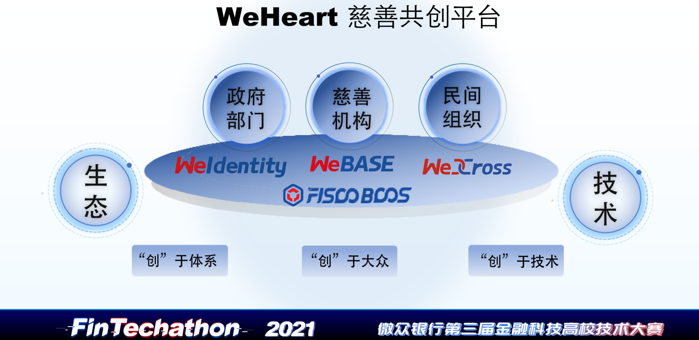
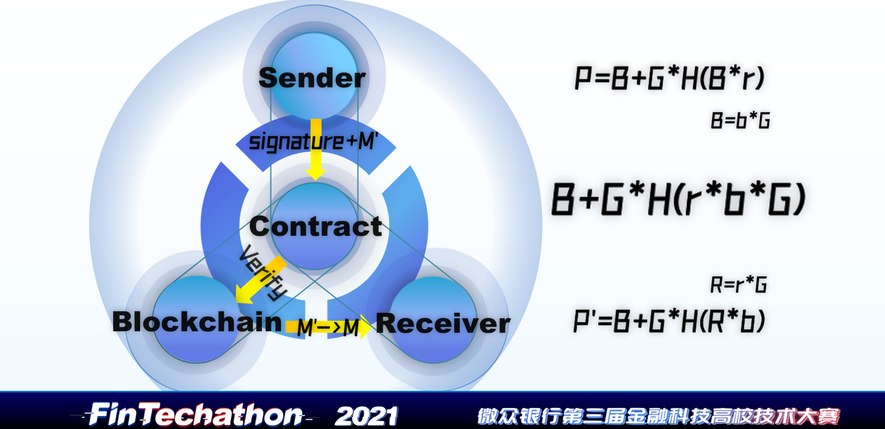
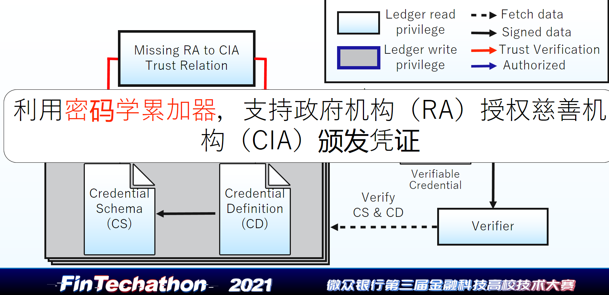
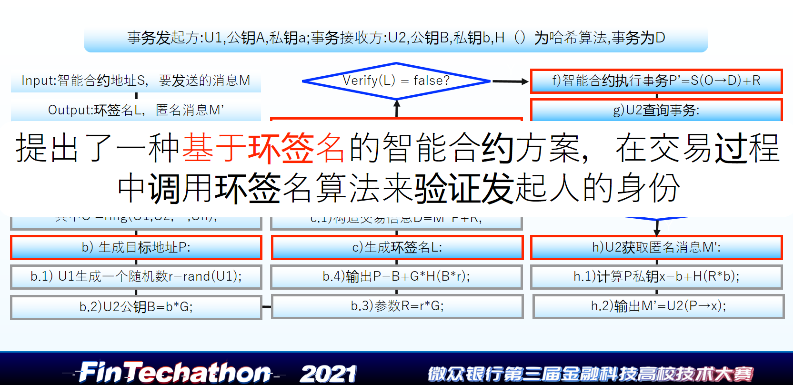
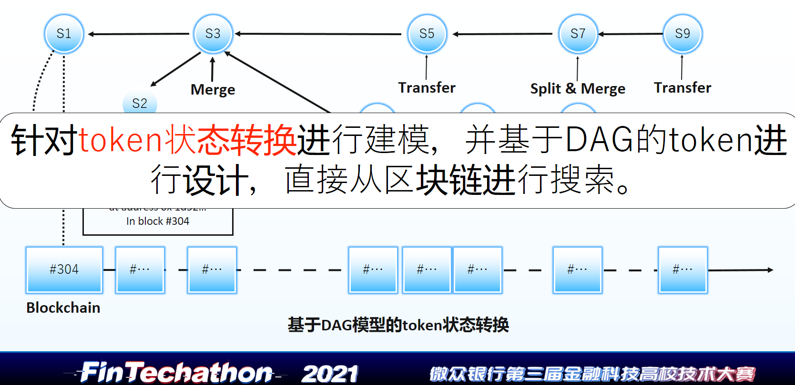
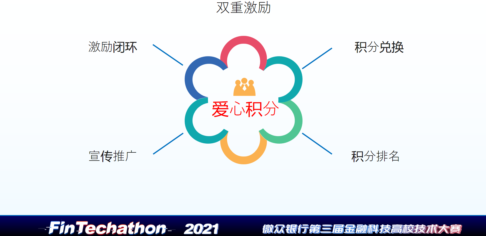
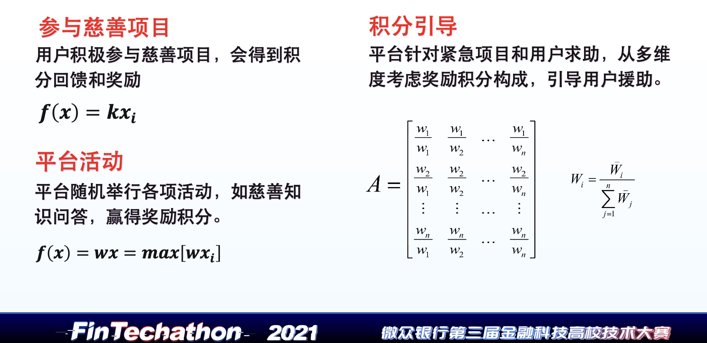

# WeHeart - 基于区块链的慈善共创平台

---

## 项目简介

---

WeHeart 是一个基于FISCO BCOS联盟链的慈善共创平台。基于增强信任、美化生态、优化技术三个理念，WeHeart 通过实现DID与VC中信任验证流程完善、设计基于环签名的智能合约算法、基于DAG的token以及爱心积分模型，旨在构建一个共创、共享、共赢的慈善平台，推动构建“我为人人，人人为我”的公益生态。

---

## 项目背景

---

- 慈善事业的发达程度是一个社会文明进步的标志，也是构建和谐社会和幸福中国的文明基石。中国的慈善事业发展至今，已经对全社会都产生了巨大的影响。面对弱势群体，我们都积极帮扶救助；面对突如其来的自然灾害，我们都纷纷伸出援助之手。在慈善活动中，公众的参与度以及公众的捐款数额占比呈现逐年上升的趋势。
- 但是，我国慈善事业在发展进程中，也不断浮现出一些我们需要重视的问题。近年来，我们经常看到一些新闻报道。例如，常年热衷慈善的市民在突发重大的家庭变故后在社会上募捐，终于筹齐了救命钱，却被一些人质疑其明明有能力负担得起，为什么还要募捐。一位常年坚持献血的爱心市民，在拿着沉甸甸的献血证希望能够在危难关头救助自己的家人，却被告知自己的献血证有这样或那样的限制条件。
- 针对各种慈善公益现象所折射出的间题，主要体现在公信力不足、信息不够公开、善款去向不明、监督体系不完善等。
- 区块链去中心化、透明可追溯的技术优势，特别适合于公益慈善领域。公益慈善领域目前存在的一些突出问题可以通过应用区块链技术得到比较好的解决。
- 据此，我们团队提出了一套基于区块链的慈善共创方案，在政府、权威机构、民间慈善力量以及广大群众间搭建起桥梁。

---

## 项目目标

---

针对大众对于公益慈善事业的质疑、其中存在的个人隐私问题、以及因此导致的信任危机问题，通过公益凭证、智能合约、慈善激励机制等技术手段，倡导全民慈善，促进社会担当，构建一个基于区块链的共创、共享、共赢的慈善平台。

一、平台共创，凝聚角色集思广益

1. 共创优质慈善品牌

- 优质平台共治

  - 普通用户、慈善机构、政府机构与WeHeart平台构成网状拓扑结构
  - 各个角色开放参与平台治理，角色自治促进平台共治

- 优质信任验证

  - 密码学安全认证协议完善信任验证机制

  - 基于环签名的智能合约算法验证交易者身份

- 优质搜索效率

  - 基于DAG的token模型实现资金信息快速搜索

2. 共创健康生态环境

- 健康品牌形象
- 健康市场推广
- 健康平台体系
  - BCOS联盟链提供技术支持
  - 积极接受用户建议合理采纳
  - 多元化角色活跃平台新生态
  - B2B2C模式扩展整个慈善链

3. 共创持续发展机制

- 坚持 WeHeart 共创共享共赢理念
- 坚持公开透明可溯机制
- 坚持贡献值评价机制
- 坚持激励反馈机制

 二、资源共享，确保持续稳定成长

1. 共享项目信息

- 链上交易信息公开透明，用户随时可搜索查询

2. 共享平台流量

- 优质用户与机构的项目会获得平台更多流量支持与激励反馈

3. 共享慈善成果

- 各个角色团结协作，秉持成果共享发展理念，可开拓更宽慈善发展道路

 三、成员共赢，促进慈善事业发展

1. 用户所获

- 捐赠信息公开透明可溯，可保障用户资金安全
- 优秀建议被平台采纳，可增加用户心理获得感
- 爱心积分兑换平台奖品，可激励用户积极参与慈善
- 得到资质认证后可在自己困难时申请求助
- 今天我帮助他，明天他帮助我，用户在力所能及做慈善时也是给自己买上一份保险

2. 机构所获

- 更高的曝光度
- 更多的用户来源
- 更快速的信息交流
- 更高效的慈善合作

3. 政府所获  

- 提高政府参与程度

- 减轻政府监管压力

4. 平台所获

- 用户粘性与品牌归属感
- 成长价值与发展空间

---

## 方案

---

一、平台架构

- 基于FISCO BCOS联盟链，运用WeIdentity、WeBASE、WeCross等组件
- 连接政府部门、慈善机构、民间组织与爱心群众
- 秉持增强信任、美化生态、优化技术三大理念，着力构建共创、共享、共赢的慈善平台

二、解决方案

1. DID与VC中信任验证流程的完善

- 针对广大用户对于求助信息真实性的质疑，我们进行了DID与VC中信任验证流程的完善

- 用户可以在链上注册属于自己的 weheartidentity DID，以构建起公众的公益履历
- 公益机构按照规范生成公益信息凭证并关联到用户的 DID
- 在发布求助信息时，用户可以展示其公益凭证，捐助人在捐助前可进行凭证验证，从而实现增信的目标

2. 基于环签名的智能合约算法

- 针对用户隐私信息无法动态保护的问题，我们利用密码学累加器使政府能够授权慈善机构颁发凭证；并设计了基于环签名的智能合约算法

- 发送方将处理过的交易信息和生成的环签名交由智能合约处理，任何拥有所有环签名成员公钥的人可对环签名进行验证，但只有接收方可从交易信息中提取出有用信息，实现发送消息的匿名化

3. 基于DAG的token设计

- 在信息溯源上，现有的 token设计缺乏检索的有效模型，且效率低下，并且还存在随着区块链的增长而导致的检索性能降低的问题
- 因此我们采取了基于DAG的 token设计方案，根据 token状态转换，记录慈善物资、资金的流动情况，达到快速溯源的效果

4. 爱心积分模型

- 为了构建合理的慈善激励积分机制，我们综合考虑了用户对慈善项目与平台活动的参与度、项目权重、以及对于慈善项目的关注度等，构建一系列积分生成函数进行积分引导
- 通过积分激励机制，营造一个有温度的正能量传播平台，通过积分兑换，积分排名，朋友圈推广，实现捐助人的激励闭环，让捐助人真正得到物质和精神的双重激励

