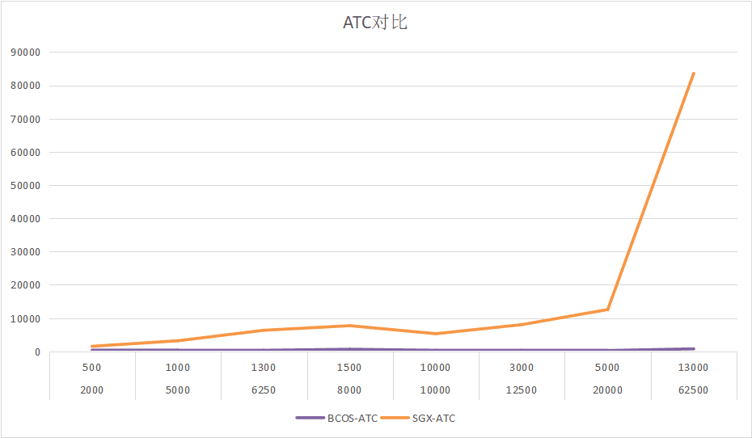
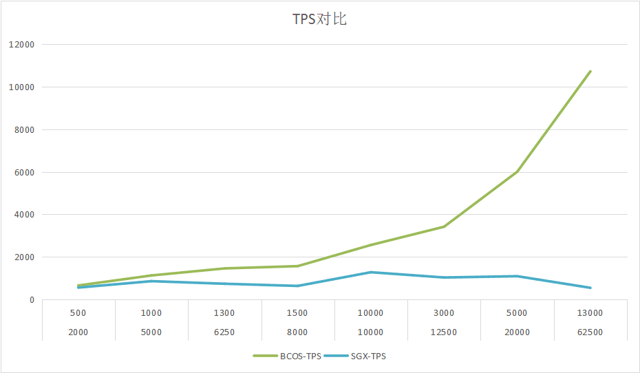

# TEEChain开发方案

【这一章介绍两个开发流程，并注明目前进度：任务1：Raft共识算法实现。FISCO BCOS 3.x版本目前仅实现了PBFT共识算法及对应优化，该任务负责在3.x版本中实现Raft共识算法及可能的优化。BCOS 2.x版本中有Raft算法实现，可以参考。任务2：区块链系统移植。FISCO BCOS区块链平台并不考虑可信执行环境（TEE），该任务负责将FISCO BCOS 3.x版本移植到SGX内（已完成移植，待进行性能优化）】

基于上文的论述，为了基于FISCO BCOS 3.x版本实现一个吞吐量高、可用性广、延时低的区块链系统，同时保证系统内执行应用的代码、数据和状态等用户隐私的机密性，TEEChain机密区块链开发方案分为两个部分：Raft共识算法实现和区块链系统移植。

### 环境

使用的操作系统为 Gramine 1.3.1版本 [Quick start — Gramine documentation](https://gramine.readthedocs.io/en/v1.2/quickstart.html#prerequisites)

可信执行环境（TEE）为SGX2.0版本

使用的FISCO BCOS为3.1.0版本。 [FISCO BCOS v3 v3.1.0 文档 (fisco-bcos-doc.readthedocs.io)](https://fisco-bcos-doc.readthedocs.io/zh_CN/latest/docs/develop/stress_testing.html)

### 编译过程

我们在本地使用Gramine拉取FISCO BCOS的文件，编译源码后得到air版本的二进制文件。

随后创建一个本地的区块链网络，此处可参考FISCO BCOS官方文档中的教程。

将该区块链网络中的二进制文件更换为编译好的air版文件。

编写Gramine中的Makefile和fisco-bcos.manifest.template从而生成在SGX中运行二进制文件所需要的相关配置文件。

在fisco-bcos.manifest.template中调整参数，从而让air版的二进制文件更好的适配SGX

编译每个节点，随后更改启动脚本中的命令，将其更换为用gramine启动fisco的命令。

随后即可开启节点。

### 实验数据对比

- 

- 

# Raft共识算法实现

## 方案介绍

FISCO BCOS 3.x版本目前仅实现了PBFT共识算法及对应优化。但我们的方案将区块链与可信执行相结合，执行节点可以信任，PBFT算法的拜占庭故障容错性稍显冗余，反而会导致性能的下降。为了提升系统的性能，我们将替换原来BCOS3.0 中的PBFT算法。

### BFT与PBFT算法

BFT[4]（Byzantine Fault Tolerance），即拜占庭容错，是一种共识机制，源于拜占庭将军问题，其目的是要解决在非信任环境下（可以简单理解为非可信执行环境内），节点如何达成共识的问题。共识协议根据是否支持拜占庭故障划分为 BFT共识协议和 CFT共识协议。

PBFT（Practical Byzantine Fault Tolerance）算法是BFT算法的一种，由Miguel Castro和Barbara Liskov在1999年提出。FISCO BCOS 3.0目前仅实现了PBFT共识算法及对应优化。

### CFT与Raft算法

CFT（Crash Fault Tolerance），即故障容错，是非拜占庭问题的容错技术，用于解决Paxos问题[5]。Paxos问题是指分布式的系统中存在故障（Crash Fault），但不存在恶意（corrupt）节点的场景下的共识达成问题，共识达成即分布式系统中的各个节点就某个值（决议）达成一致 。该场景下，消息可能丢失或重复，但不会出现虚假消息。

Raft[6]算法是CFT算法的一种，由Diego Ongaro和John Ousterhout提出。目前应用的CFT算法主要有Paxos算法和Raft算法两种，相比Paxos算法，Raft算法更易理解和实现。

### 方案选择

我们选择Raft算法作为TEEChain的共识算法，在FISCO BCOS 3.0中实现Raft算法和相关优化。

## 目前进度

目前，我们完成了对FISCO BCOS 3.0中PBFT算法相关架构和接口的梳理，但仍未完成对Raft算法的实现。

## 未来目标

未来，我们将在FISCO BCOS 3.0中完整实现Raft算法，并对其进行优化。

# 区块链系统移植

## 方案介绍

FISCO BCOS区块链平台原来在普通L环境下运行，并不考虑可信执行环境，但我们的方案需要使用可信执行环境，因此我们选择将区块链系统移植入可信执行环境。

### Intet SGX

Intel Software Guard eXtensions是Intel实现的可信执行环境，是目前最全面、最普遍的可信执行环境实现之一。

### Gramine

Graminie是一个轻量级的客户操作系统，设计以最小的主机需求运行单个Linux应用程序。Gramin可以在孤立的环境中运行应用程序，其优点与在虚拟机上运行完整的操作系统相当——包括客户定制、易于移植到不同的主机操作系统以及进程迁移。此外，Gramine支持使用Intel SGX运行Linux应用程序。 

### 方案选择

#### 环境

使用的操作系统为 Gramine 1.3.1版本 [Quick start — Gramine documentation](https://gramine.readthedocs.io/en/v1.2/quickstart.html#prerequisites)

可信执行环境（TEE）为SGX2.0版本

使用的FISCO BCOS为3.1.0版本。 [FISCO BCOS v3 v3.1.0 文档 (fisco-bcos-doc.readthedocs.io)](https://fisco-bcos-doc.readthedocs.io/zh_CN/latest/docs/develop/stress_testing.html)

### 编译过程

我们在本地使用Gramine拉取FISCO BCOS的文件，编译源码后得到air版本的二进制文件。

随后创建一个本地的区块链网络，此处可参考FISCO BCOS官方文档中的教程。

将该区块链网络中的二进制文件更换为编译好的air版文件。

编写Gramine中的Makefile和fisco-bcos.manifest.template从而生成在SGX中运行二进制文件所需要的相关配置文件。

在fisco-bcos.manifest.template中调整参数，从而让air版的二进制文件更好的适配SGX

编译每个节点，随后更改启动脚本中的命令，将其更换为用gramine启动fisco的命令。

随后即可开启节点。

## 目前进度

目前为止，我们已经成功地将区块链系统移植入可信执行环境中。我们把FISCO BCOS 3.0版本区块链系统移植到Gramine平台中，熟悉了Gramine的开发过程，并成功地使BCOS在Gramine中运行。

## 未来目标

未来，我们将对TEEChain的系统性能进行优化，提高吞吐量，减少延时。

[4]Castro, M. and Liskov, B. 1999b. Practical Byzantine fault tolerance. In Proceedings of the Third Symposium on Operating Systems Design and Implementation (OSDI), USENIX, New Orleans.]]

[5]Lamport, Leslie. "Paxos made simple." ACM Sigact News 32.4 (2001): 18-25. https://courses.cs.washington.edu/courses/cse550/17au/papers/CSE550.paxos-simple.pdf

[6]Ongaro, Diego, and John Ousterhout. "In search of an understandable consensus algorithm (extended version)." (2013). http://pages.cs.wisc.edu/~remzi/Classes/739/Spring2004/Papers/raft.pdf
