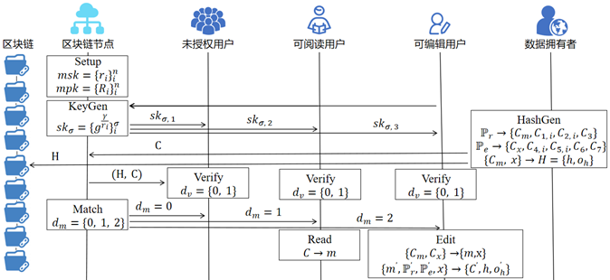

# 面向区块链的细粒度数据权限管理系统

## 项目简介

作为新一代信息技术的代表之一，区块链在促进商品要素资源在更大范围内畅通流动，助力粤港澳大湾区发展等国家重大战略和开展区域市场一体化建设工作中发挥着关键作用。然而，透明和不可篡改的区块链使得数据可信流转面临着“不能共享、不愿共享、不敢共享”的难题。

我们对该难题进行了深入调研，并就调研结果与多位专家进行交流。我们发现，数据拥有权管理混乱是导致该问题出现的根本原因。具体来说，区块链的透明性使得包括未授权的用户在内的所有用户都可以公开访问区块链上的数据，这严重侵犯了数据的机密性，进而导致数据使用权的管理混乱。此外，区块链的不可篡改性使得数据一旦上传到区块链之后就无法被编辑，这严重限制了数据拥有者行使数据编辑的权利，进而导致了数据拥有权的管理混乱。

为从根本上解决该难题，本作品拟根据用户的属性和访问策略，将用户划分为未授权用户、可读性用户和可编辑性用户三个类别。为实现该思想，我们提出了面向区块链的细粒度数据权限管理系统，严格保证用户级别权利的向下兼容性。具体地，我们利用牛顿插值定理突破了基于变色龙哈希的可编辑区块链的功能瓶颈，使其具有细粒度的权限管理和用户合谋抵抗性。随后，我们设计了一种用户策略匹配代理机制，在全面保护用户隐私（即数据隐私，属性隐私和策略隐私）的前提下，大幅度提升用户端性能。为应对现实应用中由恶意用户注销、用户账户更换等原因导致的用户频繁撤销，我们使用代理重加密设计了一种高效的用户撤销机制，实现用户撤销仅需常数级别开销，无需大规模更新密钥或密文。随后，为验证系统的实际性能，我们基于FISCO BCOS平台和微众区块链系列开源技术设计并实现了该系统。测试结果显示，该系统不仅具备设计阶段所提出的所有功能，而且在性能方面相比于最新的相关方案，用户端性能提升近10倍。

理论分析和实验评估等多方面分析结果表明，我们提出的面向区块链的细粒度数据权限管理系统，可以有效保障区块链应用中数据“能共享、愿共享、敢共享”的需求，推动区块链技术应用于大湾区一体化建设等国家重大战略中。

## 项目背景

自改革开放以来，中国大陆与香港、澳门两地从经济、贸易、科技等方方面面已经建立了密切的联系。港珠澳大桥、广深港高铁、佛莞城际铁路等跨海大桥以及轨道交通的完成实现了大湾区之间的交通联通。等到深中通道、深珠通道完成，持续数十年的大湾区“硬联通”已经完成。那么，大湾区下一阶段的一体化进程的重点就是“软联通”，即解决珠江两岸之间数据要素难以跨境、跨域使用的现实问题。

大湾区开启建设以来，正在发生功能定位、创新定位、产业布局、协同发展等重大变化。唯有依靠科技、依靠创新，才能更高效率、最大限度消除联通的障碍和鸿沟，融合制度的差异和不同。在今年的7月19日，中国（深圳）综合开发研究院联合微众银行在深圳发布《数“链”大湾区——区块链助力粤港澳大湾区一体化发展报告（2022）》。报告提出，以区块链为代表的数字技术在破解粤港澳大湾区制度差异坚冰、支撑实体经济跨越和赋能社会治理创新等方面能够发挥重要作用。特别是在现当下的疫情防控期间，合理利用区块链技术可以加速融合实体经济的跨域和社会治理创新，有力助推粤港澳大湾区一体化发展步入新时代。具体而言，区块链技术具有两大优势：一是由用户自主传递跨境数据，粤澳两地机构不直接传输和交换用户数据，从而解决了两地数据跨境使用的体制机制障碍；二是基于区块链技术，比对哈希值而非具体信息内容、核对校验数据真实性，可以有效保护用户与机构的数据隐私，降低跨境数据可信风险和滥用风险。

随着社会的全面信息化，数据已成为时下具有重要经济价值的资源。但是，人自身行为的数据以及人与人之间的交互数据，涉及了个人信息与隐私；企业之间的数据流动会涉及公司竞争与商业机密。数据的重要性是不言而喻的。2020年5月25日，最高人民法院院长周强在《最高人民法院工作报告》中指出：“加强数据权利司法保护，有利于大数据利用、数字经济发展，有利于公民个人隐私保护。”这是数据首次作为一种权利而不是一种利益出现在最高人民法院的报告中。因此，数据确权的需求也应运而生。数据确权即数据产权的确定，其保护的是数据权利人对数据财产直接控制和支配的权利。大湾区的建设与协同发展不可避免地会带来大量的数据流动，再加上区块链上数据共享的特性，明确数据所有者的主体身份是一种保护数据隐私、维护数据主权、建立安全可信的数据共享体系的重要前提。没有确权，健康可持续的数据交易市场也难以运转起来。数据确权已然成为实现数据安全有序流动和数据资产化不可或缺的重要前提。

区块链作为一种新兴的技术，在大湾区建设过程中发挥了不可或缺的重要作用，能够为参与者提供公共且不可篡改的共识。但是透明且不可变的区块链技术不可避免的地造成了两个问题。一是，透明的区块链难以保证数据的机密性，因为即使是未授权的用户也可以访问数据。二是，不可变的区块链无法实现内容编辑的功能，一旦智能合约被部署，它将不可再被更改。这两个限制导致了现有区块链技术中所有权治理的混乱，不幸的是，现有研究工作无法支持综合数据权的划分和治理。例如，为了控制数据的可读性并保证数据的机密性，在将数据上传之前，可以使用许多加密原语对数据进行加密，这就忽略了数据的可编辑性。为了实现可编辑性，一些基于变色龙哈希的解决方案被提出。这些方案可以重写或压缩分散服务中任意数量块的内容。但是这些作品对于可读性的忽视就无法对数据所有权实现很好的保证。这两个问题的出现导致了区块链的数据确权问题。实际上，数据确权保证的是可读性和可编辑性的重要组合。为此，在利用区块链进行数据平台建设的过程中，保证数据确权是一个十分重要且亟待解决的问题。

数据确权的实现有助于解决数据所有者的后顾之忧，顺利破解数据“不能共享、不愿共享、不敢共享”的难题。在此基础上，大湾区地区的数据所有者便能实现隐私保护下的数据跨域流通，促进两岸三地的“软联通”。为此本作品聚焦区块链平台的数据确权问题进行了研究，以此助力大湾区数据流通健康体系的建设。

## 项目目标

本系统拟解决以下问题。假设数据所有者向区块链节点提交由消息加密的数据)，针对阅读者的策略和针对修改者的策略，其中。具有属性的用户尝试访问该消息。所有用户可验证数据包含的哈希值H的有效性。若,则为未经授权的用户，无法阅读该消息。若,则为可阅读用户，只能阅读该消息。若，则为可编辑性用户，可以阅读和编辑该消息。为减少查询开销，用户可生成陷门,区块链节点根据返回相应数据，同时不影响用户隐私。
此外，本系统实现隐私保护的策略匹配代理功能。在实现全面的用户隐私保护（数据隐私，属性隐私和策略隐私）的前提下，实现策略验证和用户真实性验证，需要花费用户大连的资源开销。为解决该问题，我们结合方案策略匹配过程，设计了一种隐私保护的策略匹配代理机制，将数据检索和真实性校验的开销代理给服务提供者。在这种机制下，系统的性能得到了充分的利用，同时用户端可以实现近常数级开销。
支持高效的用户撤销机制也是本系统需要实现的功能目标。在现实应用中，诸如恶意用户注销、诚实用户注册多个账户等行为均会导致用户撤销情况。这给现有系统的设计与实现带来了一个巨大的难题。如果不能很好地处理用户撤销情况，系统不仅面临着巨大的系统资源开销，更面临着隐私泄露的严峻威胁。

## 方案

如系统流程图所示，系统工作流程主要分为以下几个部分。在系统初始化部分，系统中特权区块链节点交互生成系统主密钥与主公钥。随后数据请求者选择特权节点，利用自身属性请求用户密钥。为实现不同的用户属性产生不同的密钥，本方法引入代理重加密来实现这一目的，并防止用户通过交换属性进行合谋。在哈希生成阶段，用户为自身数据选择2个策略，分别为用户管理数据使用权（可读性）和数据拥有权（可编辑性）。区块链上任何用户都可以验证哈希值的有效性，进而保证用户数据的完整性和防止非法篡改数据。匹配阶段用于实现隐私保护的匹配代理功能，根据用户属性为用户将数据库中的数据进行分级。在阅读和编辑阶段，授权用户可以行使自身权利来操作数据。在编辑节点的过程中，考虑到被重新上传的数据的权限管理问题，用户可以重新自定义数据的策略，进行数据保护。

系统流程图

该方案由七个概率多项式时间的算法组成，具体如下：
$Setup(\lambda\rightarrow{msk,mpk})$：由特权节点运行，生成双线性群$(p,q,G,G_T,e)$,其中，$e:G\timesG\rightarrowG_T$,假设属性域为$U$,大小为$n$，特权节点选择$n$个随机值$\left\{r_i\right\}_i^n并计算\left\{R_i=g^{r_i}\right\}_i^n$。接下来，特权节点共享两个抗碰撞哈希函数$H_1[G\rightarrow\left\{0,1\right\}^\ast]和H_2[G_T\rightarrowZ_p]$。然后，特权节点共享主密钥$msk=\left\{r_i\right\}_i^n$并发布主公钥$mpk=\left(p,g,G,G_T,e,\left\{R_i\right\}_i^n,H_1\left[\cdot\right],H_2\left[\cdot\right]\right)$。
$Keygen(\left\{msk,\sigma\right\}\rightarrowsk_\sigma)$：用户选择一个特权节点，根据其属性集生成密钥$msk$。特权节点随机选择一个值$\gamma\inZ_p$, 计算$sk_\sigma=\left\{g^\frac{\gamma}{r_i}\right\}_i^\sigma$。然后，特权节点将$\gamma$发送给区块链节点，将s$k_\sigma$发送给用户。若需要撤销数据分享系统中的用户，区块链节点只需移除对应的$\gamma$，使$sk_\sigma$失效，无法恢复任何消息。
$HashGen(\left\{P_r,P_e,m,x\right\}\rightarrow{C,H})$：数据所有者向区块链节点提交信息$m\inM$, $M$为消息空间。数据所有者为用户生成两个访问策略，$P_r$用于阅读者，$P_e$用于修改者。为实现向下兼容，$P_r$和$P_e$满足$P_r\inP_e$。$x$为数据所有者的私钥。通过该算法，数据所有者生成对应密文$C={C_m=m\cdote\left(g^{O_1},g^{S_1}\right),C_{1,i}=R_i^{K_r\left(i\right)\cdotN_{r,i}\left(0\right)\cdoto_1},C_{2,i}=R_i^{K_r\left(i\right)\cdotN_{r,i}\left(0\right)\cdoto_2},C_3=g^{o_2\cdotS_1},\ C_x=x\cdote\left(g^{o_3},g^{S_2}\right),C_{4,i}=R_i^{K_r\left(i\right)\cdotN_{r,i}\left(0\right)\cdoto_3},C_{5,i}=R_i^{K_r\left(i\right)\cdotN_{r,i}\left(0\right)\cdoto_4},\ C_6=g^{o_4\cdotS_2},C_7=g^x}$和哈希值$H={h,o_h}$。

