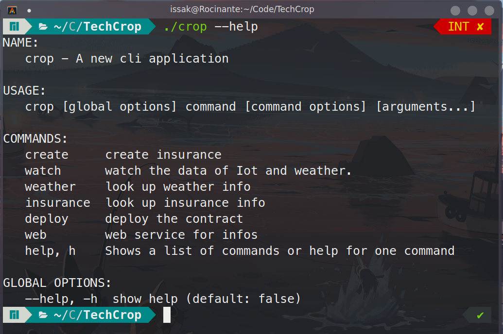

## 使用说明
- TechCrop_Web： 前端页面
- TechCrop： 后端项目

进入TechCrop_Web目录：
```shell
yarn build
```

构建成功后将build文件夹移动到TechCrop中

移动外部Contracts下的文件到TechCrop的contracts目录下

进入TechCrop目录，提前下载[solidity编译器](https://github.com/ethereum/solidity/releases)（0.4.25版本与0.6.0）

编译合约：
```shell
-- 0.4.25可以通过命令行安装
-- bash tools/download_solc.sh -v 0.4.25

./solc-0.4.25 --bin --abi -o ./contracts/oracle ./contracts/oracle/APISampleOracleReturnString.sol --overwrite

./abigen --bin contracts/oracle/APISampleOracleReturnString.bin --abi contracts/oracle/APISampleOracleReturnString.abi --pkg oracle --type Oracle --out contracts/oracle/APISampleOracleReturnString.go


./solc-static-linux- --bin --abi -o ./contracts/insurances ./contracts/insurances/Insurance.sol --overwrite

./abigen --bin contracts/insurances/Insurances.bin --abi contracts/insurances/Insurances.abi --pkg insurances --type Insurance --out contracts/insurances/Insurances.go
```

构建命令行工具
```shell
go build ./bin/crop/crop.go

使用：
./crop --help
```

> 使用之前需要启动本地的fisco网络，并将节点的sdk目录中的证书文件放到TechCrop根目录下
> 配置文件：config.toml

