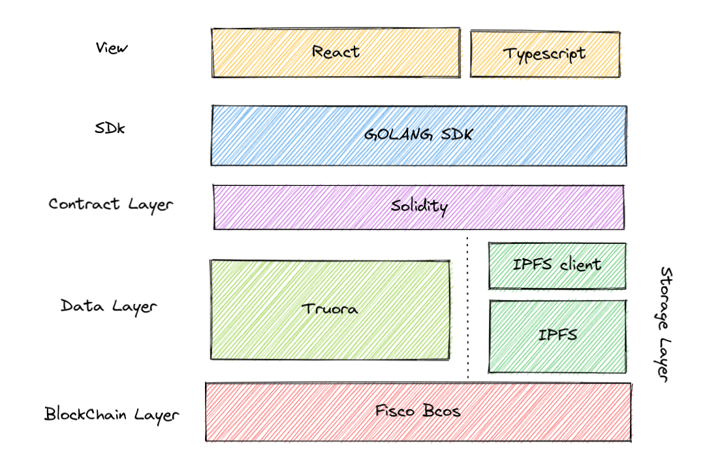
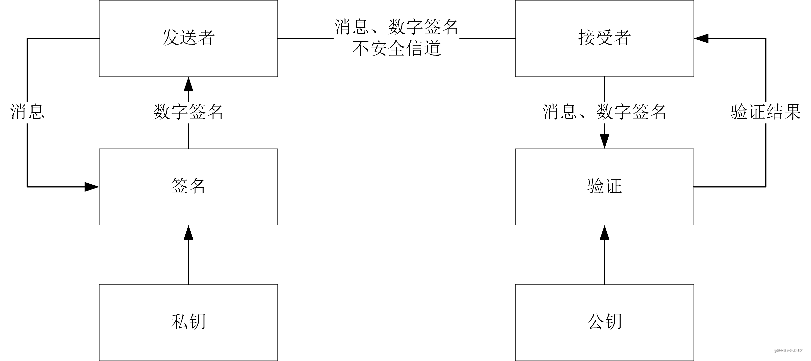

# 基于区块链技术的农作物经济应用

## 简介

基于区块链技术的农作物经济新应用——TechCrop，可提供结合实时播报提供精确的气象数据，基于乡镇级别气象预测信息，结合历史气象数据，可预知潜在气象风险，规避重大气象风险。在重大气象灾害发生前可提前预知，农户可以采取提前收割等措施减少自然灾害的影响。在重大气象灾害发生后，若提前购买了保险，可按照流程理赔。若发生保险法律纠纷，则可按照下述流程解决。我们创新性地提出了基于区块链技术的新型农作物种植方案，并基于此实现了更高可信度、准确度的方案执行条件。

## 许可证

本项目以双重许可（dual-license）的形式开源。其中，软件本身的许可证为[AGPLv3](https://github.com/podiumdesu/webank-hospital/blob/master/LICENSE.AGPLv3)，而所有静态资源（图片、视频等）、文本文件的许可证为[CC BY-NC-ND 4.0](https://github.com/podiumdesu/webank-hospital/blob/master/LICENSE.CC-BY-NC-ND-4.0)。

## 背景

### 现存问题

#### 气象数据

- 农作物培育过程中，天气多变且不可控，从农户查看天气情况到执行相应的应对措施的过程，花费的实际时间较为缓慢且不精准，农作物不能得到及时且最合适的灌溉或施肥。
#### 保险措施

- 在传统农业保险这个链条上，各节点（包括农作物种植者、保险公司、政府）都有可能做出不符合实际情况的主观选择。
- 在极端天气突发或遇重大自然灾害的情况下，造成的损失不可估量且无可挽回，并且没有现存较为完备的保险措施来应对风险。

### 本作品的贡献

- 创新性地提出了**基于区块链技术的新型农作物种植方案**，并基于此实现了更高可信度、准确度的方案执行条件。
    - 使种植全流程精准化、透明化、可追溯
    - 极大程度地节省了人力物力资源，实时满足农作物生长所需条件
    - 各节点运作全流程可追溯，实现了操作不可篡改与不可抵赖
    - 减轻了用户的存储、计算、传输的开销

- **Truora预言机**使用

    - 集成Truora预言机的农作物保险智能合约从多个数据源获取天气数据，聚合成单一数据触发链上保险合约执行，最后在传统支付网络中支付赔偿金。

- 使用**BLS**作为多重签名、聚合签名方案，实现了签名的优化

    -   将保险验证签名的存储与验证开销从线性降至常数
    -   一个节点的参与者所提交的数据由其本人与后续节点共同签名，进一步保证了保险合约的真实性
    -   具有优秀的可扩展性，如在多重签名时可以同时加入政府等部门的签名
    
- 使用**DSA**数字签名算法作为数据层面的签名方案，实现业务数据的认证

    -   确保数据的有效性在各方受到认可
    -   确保气象数据的真实性，即数据从获取至上链未经过篡改
    
- 实现了良好的农作物种植生态
    - 所有的业务数据交互传递复杂度低
    - 在链上完成全流程的业务，实现了良好的用户体验

- 集成了**IPFS**

    -   防止在节点之间同步大量的数据
    -   减轻了节点存储与传输的负担
    -   保证了整个区块链网络的性能
    
## 功能

### 痛点解决

针对所述现存问题，我们提出以下方式解决：

#### 对于气象数据的问题

- 获取气象局检测数据
    - 连接气象局数据接口，实时接收气象数据判定是否为重大气象灾害。
    
- 实时上传农作物信息
    - 在农作物进行播种之后，实时上传农作物信息，并通过LoT传感器获取土壤温度、湿度、生长情况等数据同步上传信息，达到某一条件后触发智能合约，随后执行特定的动作例如极其十分、自动灌溉，以增加农作物产量，提升农作物经济总体质量。
    - 根据设定的灌溉/施肥条件，依据获取到的数据来判断并执行农作物种植方案。

#### 对于保险措施的问题

- 判断天气情况
    - 在种植农作物期间，通过LoT传感器获取的数据结合气象数据分析并预测结果，判断是否为重大自然灾害。
- 执行保险业务
    - 若事先已购买购买保险服务，则触发保险合约进行保险理赔。
    - 触发保险合约后，即可进行保险理赔以保障收入。
    - 若发生法律纠纷，监管机构可通过登录链上安全账户查询链上保险合约，调用发生灾害时的气象数据来进行判定并给出解决方案。
    
### 功能模块

1. 种植环境数据上链模块

    操作人员提前设置智能合约触发条件，并使用IoT传感器实时监控种植环境数据，检测后数据直接上链保存。

2. 连接IoT传感器模块

    IoT传感器与接收农作物种植数据后，上传到区块链上，实现数据的不可篡改和可溯源性。

3. 结合气象数据分析模块

    平台通过从气象局处实时接收的气象数据与IoT传感器接收到的种植环境数据结合进行分析，得到是否为重大气象灾害的结果。

4. 触发保险智能合约模块

    得到3.模块后的数据分析结果后，若为重大气象灾害且用户提前购买了保险，则触发智能合约进行理赔流程。

5. 链上安全账户模块

    若保险流程发生法律纠纷，监管机构则登录平台的链上安全账户进行查询。

6. 个性化模块

    用户注册链上节点后，可选择个性化定制服务，根据种植物种类的不同灵活地选择服务模块，如：种植年收果树，种植季节性小菜等。

7. 其他业务模块

    在实现主要业务功能的前提下，为种植户提供保险理赔后的资产管理，接入银行等机构在链上完成资产清算等业务。
    
## 技术栈

- 前端    

    - React-router v6  
    
    - Material-UI
    
- 后端

    - go
    
- 区块链网络

    - 平台
    
        - FISCO-BCOS
        
    - 预言机
    
        - Truora
        
    - 合约
    
        - Solidity
        
    - 存储
    
        - IPFS

        
 ## 项目流程

1. 在农作物进行播种之后，即时上传农作物播种详细信息到链上进行实时监控，并通过LoT传感器获取环境中土壤温度、湿度、生长情况等数据同步上传信息。

2. 在农作物生长过程中，若满足提前设定好的施肥或灌溉条件，则会执行该特定动作（例：机器施肥，自动灌溉，湿度调整等）全程保障农作物生长状况良好，实现全程自动化、精准化、可控化，增加农作物产量和质量。

3. 在农作物生长或收割过程中，根据链上气象数据进行实时分析来预测气象结果，评估是否为重大自然灾害。若否，平台则采取相应预防措施避免农作物因自然灾害降低产量。若是且用户提前购买了灾害保险，则触发保险智能合约进行保险理赔，从而保障收入。

4. 在用户进行保险理赔的过程中，若发生保险纠纷，监管机构则登录链上安全账户以查询链上保险合约查询相应气象分析数据结果，从而进行判定解决纠纷。

## 技术内容

## whiteChainTeam联盟链架构说明文档  
---  
  
### 联盟链组成  
  
**此联盟链由一个群组四个机构共12个节点组成：**  
  
1. 四个机构包括:Climitic、Insurance、Supervision、PovertyAlleviation  
  
2. 本地测试12个节点的端口和P2P配置地址：  
    |  机构              | 节点    |  群组  |     P2P       |  
    |  ----              | ----    |  ----  | ----         |  
    | Climitic           | 节点0   | 1、2 | 127.0.0.1:30300 |  
    |                    | 节点1   | 1、2 | 127.0.0.1:30301 |  
    |                    | 节点2   | 1、2 | 127.0.0.1:30302 |  
    | Insurance          | 节点3   | 1、3 | 127.0.0.1:30303 |  
    |                    | 节点4   | 1、3 | 127.0.0.1:30304 |  
    |                    | 节点5   | 1、3 | 127.0.0.1:30305 |  
    | Supercisio         | 节点6   | 1、4 | 127.0.0.1:30306 |   
    |                    | 节点7   | 1、4 | 127.0.0.1:30307 |  
    |                    | 节点8   | 1、4 | 127.0.0.1:30308 |  
    |PovertyAlleviation  | 节点9   | 1、5 | 127.0.0.1:30309 |  
    |                    | 节点10  | 1、5 | 127.0.0.1:30310 |  
    |                    | 节点11  | 1、5 | 127.0.0.1:30311 |  
  
3. 重要的文件： 

    - ca.key:联盟链私钥  
    - ca.crt:联盟链机构证书  
  
4. 使用到的工具  

    - 运维工具 -generator.sh  
    - 控制台工具 -/console.start.sh  
  
### 账户生成  
  
1. 在每个节点下的account目录下生成.pem文件  
  
2. 使用到的工具 -get_account.sh  
  
### SDK(go)配置  
  
**注意事项**  
1. 需要先有账户的生成(.pem或者)  
  
2. FISCO BCOS 2.2以上版本节点.需要对.toml文件进行配置，以及相应的机构证书、sdk证书和sdk密钥  
  
3. 通过go-sdk文件下的console.go与联盟链进行交互

## 算法
### DSA数字签名算法

DSA全称Digital Signature Algorithm，DSA是一种算法，它不能用作加密和解密，也不能进行密钥交换，只用于签名，所以它比其他数字签名算法要快很多，安全性也能得到保障。DSA的一个重要特点是两个素数公开，即使不知道私钥，也能确认它们是否是随机产生的。

DSA的整个签名算法流程如下：

a. 发送方使用SHA-1和SHA-2编码将发送内容加密产生的数字摘要；

b. 发送方用自己的专用密钥对摘要进行再次加密得到数字签名；

c. 发送方将原文和加密后的摘要传给接收方；

d. 接收方使用发送方提供的密钥对进行解密 ，同时对收到的内容用SHA-1/SHA-2编码加密产生同样的摘要；

e. 接收方再将解密后的摘要和d步骤中加密产生的摘要进行比对，如果两者一至，则说明传输过程的信息没有被破坏和篡改，否则传输信息则不安全。

### BLS算法

BLS 签名算法是一种可以实现签名聚合和密钥聚合的算法（即可以将多个密钥聚合成一把密钥，将多个签名聚合成一个签名）。在未来的开发中，要保证系统的安全性，同时节约存储空间，就需要用到这类签名聚合的算法。不需要随机数生成器，可以将区块中的所有签名聚合成一个，容易实现 m-n 多重签名，也可以避免签名者之间的多余通信。除此之外，BLS 签名的长度更短（签名为椭圆曲线上的一个点而非两个），是 Schnorr 或 ECDSA 的 2 分之一。

BLS有如下优点：

  - 不需要随机数生成器，可以将区块中的所有签名聚合成一个；

  - 容易实现 m-n 多重签名，也可以避免签名者之间的多余通信；

  - 签名的长度更短（签名为椭圆曲线上的一个点而非两个），是 Schnorr 或 ECDSA 的 2 分之一。
