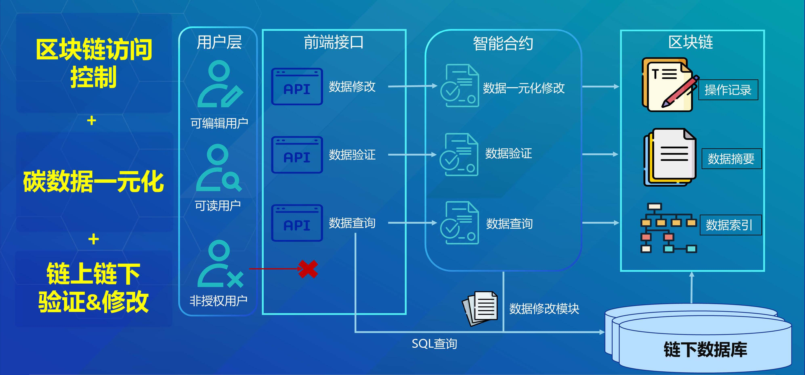

# 环境依赖
1. 集成开发环境：Vscode、Remix、Neovim
2. 区块链平台：[FISCO-BCOS v2.9.1 文档](https://fisco-bcos-documentation.readthedocs.io/zh-cn/latest/)
3. 软件开发工具包：[Python-SDK 文档](https://fisco-bcos-documentation.readthedocs.io/zh-cn/latest/docs/sdk/python_sdk/index.html)
4. 中间件平台：WeBASE
5. 硬件环境：腾讯云ECS服务器一台 RAM：4 GB ，CPU: 2核，带宽：5Mbps
6. 操作系统：Linux Ubuntu 22.04 LTS
7. 开发语言：Solidity（智能合约）、Python（后端开发）、HTML+CSS+JavaScript（前端开发）

# 项目背景

改革开放以来，中国经济加速发展，目前已成为全球第二大经济体、绿色经济技术的领导者，全球影响力不断扩大。事实证明，只有让发展方式绿色转型，才能适应自然规律。同时，随着全球气候变化对人类社会构成重大威胁，越来越多的国家将“碳中和”上升为国家战略 ，提出了无碳未来的愿景。2020年，中国基于推动实现可持续发展的内在要求和构建人类命运共同体的责任担当，宣布了碳达峰和碳中和的目标愿景。“双碳”目标提出有着深刻的国内外发展背景，必将对经济社会产生深刻的影响；“双碳”目标的实现也应放在推动高质量发展和全面现代化的战略大局和全局中综合考虑和应对。

2021年，中国“双碳战略”开始实施，在《中共中央国务院关于完整准确全面贯彻发展理念做好碳达峰碳中和工作的意见》出台之后，碳达峰、碳中和目标要求已经全面融入经济社会发展的中长期规划，各行各业积极参与形成合力，努力转向高质量发展，实现双碳目标成为当前迫在眉睫的任务与使命。2022年6月科技部等九部门印发的《科技支撑碳达峰碳中和实施方案（2022—2030年）》。报告提出，基于区块链技术和智能合约的数字监测、报告、核查流程，支撑监测数据质量不断提升，为国家碳达峰碳中和工作提供决策支撑。作为利用市场化交易机制重新分配碳配额资源，从而实现减碳的重要途径，碳达峰和碳中和需要大量详细而真实的碳排放数据支撑。区块链因其独特的优势，在碳排放数据可靠性证明、留存、共享方面有着不可替代的优势，必将成为企业参与碳排放交易，国家进行碳中和工业生产管理的有力工具。区块链技术的本质是以数学算法建立共同信任，基于区块链能够实现碳信息的数字化、精确化、可塑化，为碳达峰和碳中和奠定坚实的基础，并解决当前碳市场信息不透明、交易效率低、市场参与度低等问题。

建立完整的碳足迹追溯体系是实现碳达峰碳中和目标的重要手段。利用区块链技术的不可篡改、全程可溯的特性，可以有效支持碳足迹全生命周期的可信记录和碳排放全要素的可信流转，为碳达峰和碳中和提供更安全、高效、经济的市场环境和监管环境。这也能够培育碳金融模式创新，并形成覆盖生产端、流通端的碳普惠机制，为实现我国“双碳”目标提供有力支撑。

具体来说，区块链技术能够实现碳足迹全生命周期的可信记录和碳排放全要素的可信流转，为碳达峰和碳中和场景提供更安全、高效、经济的市场和监管环境。例如，北京电力交易中心和国网电商公司等建设的区块链绿电交易平台，可以接入交易电厂发电数据、绿电交易数据、所有场馆用电数据，并实现全流程溯源，为冬奥会提供可视、可信、可靠证明。此外，唯链推出的区块链碳足迹追溯平台可以快速实现碳足迹精准追溯，为企业积累碳相关数据并优化自身碳足迹的全过程提供支持。蚂蚁集团提出的蚂蚁链企业碳中和管理SaaS产品一一碳矩阵，基于区块链技术实现碳排放、碳减排、清结算、监管、审计等过程公开透明，相关记录可随时追溯查证，同时实现企业碳中和数据统一平台管理以及数据可视化。最后，碳数据上链可以在政府监管部门、控排企业、第三方核查机构、碳排放权交易机构、其他社会机构之间形成真实可信数据的共享交换，为碳排放监管提供可视、可信、可靠的环境。但目前的碳数据区块链数据库不支持结构化数据，仅操作记录真实可信，防篡改，但数据可被篡改，不支持数据一元化。而混合存储架构可以有效支持碳足迹全生命周期的可信记录和碳排放全要素的可信流转。通过链下的原业务BOM数据库，可以存储碳相关数据的原始记录和业务信息。而链上的区块链数据库则用于存储操作信息、数据结构索引和数据摘要，确保数据的完整性和可信度。

# 项目介绍

如图1所示，智能合约运行在区块链平台，基于Solidity语言，连接着fisco区块链、链下数据和前端接口。它承担了数据查询、数据修改、数据验证和数据一元化等多个重要功能，为区块链应用提供了可编程和可信赖的基础设施。

数据查询：可以通过链上特定的查询函数，使得存储的双碳数据可以被方便地检索。利用这些查询函数，用户可以通过调用智能合约来获取链下数据库的相应数据，而无需直接访问底层的数据库。

数据修改：当需要对存储在数据库上的双碳数据进行更新或修改时，智能合约可以提供相应的函数和逻辑来执行这些操作。通过调用数据修改函数，用户可以向智能合约提交数据修改请求，智能合约会根据设定的规则和权限验证请求的合法性，并在验证通过后调用链下数据库并执行相应的修改操作。

数据验证：通过验证链上存储的数据索引来保证链上链下数据的一致性，一旦链下数据发生变化，需要更新链上存储的数据索引。

数据的一元化：所有参与方都能通过区块链上访问和使用链下数据库数据，智能合约作为数据的管理者和执行者，确保了数据的一致性和共享性，为参与方提供了可靠的数据交互和合作基础。

# 项目目标

本项目采取了链上链下混合存储的架构，链下为原业务BOM数据库，链上为区块链数据库，其存储操作信息、BOM数据结构索引、数据摘要。在保证数据一元化的情况下，实现双碳数据的防篡改、双碳数据操作可追溯、双碳数据确权，提升了区块链数据库的吞吐量，降低了负载。

数据修改模块结合变色龙哈希技术，负责结合数据修改请求，完成具有访问控制的数据修改，并保障数据修改前后链下数据与链上哈希值的对应性。通过控制变色龙哈希技术数据陷门，实现编辑人员的编辑权限管理；利用变色龙哈希的结果，实现链下数据与链上哈希的对应性，进而保障数据完整性。

# 项目架构图

 图1 区块链碳数据平台

# 项目流程图

 图2 区块链碳足迹流程

# 项目方案

系统架构主要分为以下几个部分。在接口合约层架构，系统中智能合约运行在区块链平台，基于Solidity语言，连通BOM区块链、链下数据和前端接口，负责实现数据修改、数据验证和数据一元化。数据修改模块结合变色龙哈希技术，负责结合数据修改请求，完成具有访问控制的数据修改，并保障数据修改前后链下数据与链上哈希值的对应性。在区块链存储层架构，存储层提供的函数都由链下数据接口实现，链下数据接口向下提供智能合约操作的接口，向上屏蔽所有数据库操作的技术细节。在链下BOM数据库层，结合业务逻辑，分析统计链下BOM数据库中数据的层级关系、对应关系、映射关系等，建立BOM数据结构索引存储在区块链上，为自动化的数据一元化提供索引。例如，修改研发BOM中的A数据，系统将自动强制修改供应链BOM中的对应的A数据，而B数据则为数据一元化中的相关数据，对A数据有依赖，系统将对提示相关人员对B数据进行协调修改。