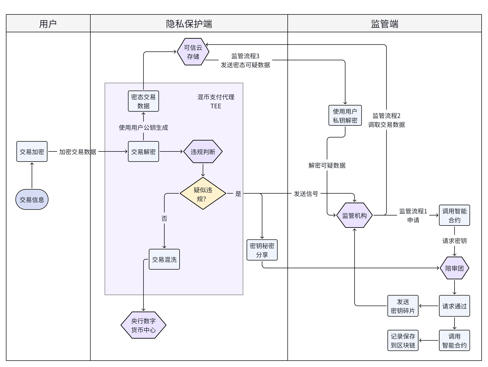
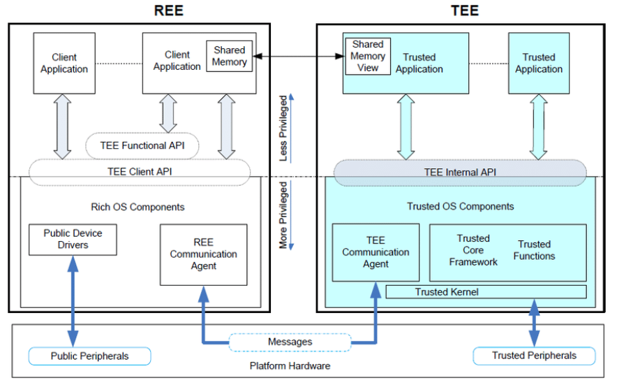
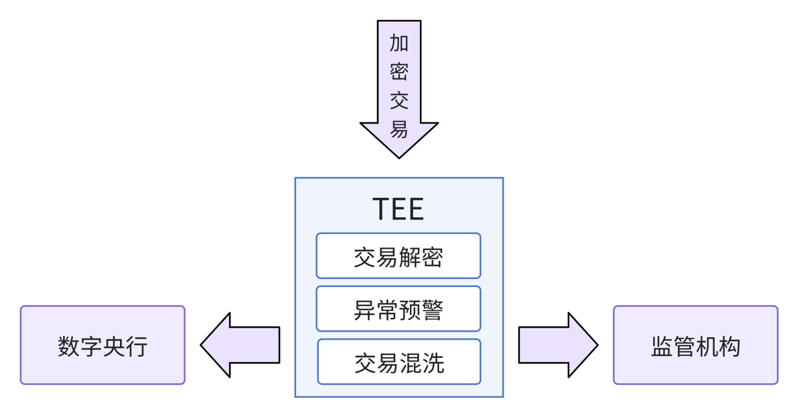

# 数字虎符：央行数字货币场景下的隐私保护系统

## 项目背景

移动支付正在成为支付领域的新常态，但随着技术更迭，移动支付的也在面临着新的挑战：

### 挑战1：对移动支付的隐私与安全担忧

数据显示，65.9%的用户在使用移动支付时担心存在安全隐患。在移动支付时遭遇安全问题的用户中，59.2%的用户遭遇个人信息泄露问题。为此，我们提出了以下构想：

1. **用户与政府之间引入技术缓冲层**：通过混币代理和评审团机制，建立了一个技术性的“缓冲层”，在用户和政府之间增加了隐私保护的屏障
2. **隐私保护机制**：交易信息经过加密、混币和脱敏处理，交易对象和第三方平台均无法直接获取用户交易信息，即使是监管机构也需要经过严格的流程和多方授权才能访问具体交易数据
3. **透明监管流程**：利用区块链和智能合约记录监管机构的密钥申请和评审过程，增加了流程的透明度和可信度，能有效地防止滥用权力
4. **平衡隐私与监管**：在保护用户正常交易隐私的同时，仍然满足了监管机构对异常交易的监控和必要的审计，这样的监管和可溯源性也是对用户交易的保护，能有效遏制电子诈骗、盗刷等问题

### 挑战2：移动支付平台（支付宝、微信支付）的市场竞争

数字人民币正面临这现有移动支付平台的竞争：从线上渗透率来看，我国线下场景移动支付用户使用产品渗透率前三的是支付宝、微信、云闪付；此外数字人民币渗透率提高最高，2023年数字人民币渗透率达到了11.9%。

调查数据显示，没有用过数字人民币但猜测其体验感和支付宝、微信支付差不多的被调查者几乎占一半。只有11.59%的被调查者使用过数字人民币，其中认为“支付宝、微信支付更好用”的人有40.98%。然而，超七成被调查者表示，在使用支付宝微信支付时有隐私方面的顾虑。

因此，隐私保护、小额钱款的追踪问题将成为本项目市场竞争优势的来源：我们将使用先进的隐私保护机制为用户提供更高的交易匿名性和隐私保护，同时，利用区块链的不可篡改特性结合数字人民币的法定货币特性，实现交易的追踪与溯源。这些功能是当前主流移动支付平台（如支付宝和微信支付）所缺乏的。

## 项目介绍

### 项目结构

我们的项目旨在通过混币服务和监管模块，在保护用户交易隐私的同时，满足监管机构的合规要求。核心思想是切断交易发送者与接收者之间的直接关联，防止交易被追踪，同时在必要时能够恢复交易链条，协助监管机构进行调查和审计。

具体的架构如下图所示：

### 核心模块

我们的项目主要包括以下两个核心模块：

- **隐私保护模块**：通过混币支付代理服务，切断发送者与接收者之间的直接链接，防止外部实体追踪交易路径；同时运用密码学，密态存储交易信息，保障用户的交易隐私
- **监管模块**：由混币代理初步判脱敏后的信息，对于可疑交易，将送至监管部门进一步审查。当检测到违规或可疑活动时，监管部门可调用智能合约向评审团请求相应的密钥，恢复交易链条，进行调查和审计。

### 项目流程

本项目的主要流程如下图所示，主要包含用户端、隐私保护端和监管端：

其中：

隐私保护端主要包括**交易数据混洗+密态存储**：

1. 交易加密发送：用户将交易信息加密后，发送给混币代理

2. 交易解密处理：混币代理在可信执行环境（TEE）中将交易解密，确保解密过程的安全性和数据的完整性

3. 交易混洗提交：混币代理将多个交易进行混洗处理，打乱交易的顺序和关联性，然后将混洗后的交易提交给数字人民币登记中心

4. 交易脱敏发送：混币代理将交易数据进行脱敏处理，去除敏感信息后，发送给监管智能体进行初步审核

5. 数据存储与密钥分发：混币代理将加密的交易数据存储在云平台上，并采用秘密共享方案，将密钥碎片分发给评审团成员（运行在区块链上）

监管端主要包括**陪审团机制监管违规交易**：

1. 违规检测： 监管智能体根据监管机构的要求，检测交易中是否存在违规或异常行为，无需访问用户的敏感信息

2. 异常情况报告： 当发现异常情况时，混币代理将涉嫌违规的账户信息发送给监管机构

3. 密钥申请流程： 监管机构通过调用智能合约，向评审团发起密钥申请，以获取解密嫌疑账户数据的权限

4. 评审团审核与密钥提供： 智能合约记录密钥申请请求，评审团成员独立评估申请的合法性。如果通过，他们将各自持有的密钥碎片发送给监管机构，同时在区块链上记录整个过程

5. 数据解密与调查： 监管机构收集到足够的密钥碎片后，合成完整的密钥，从云平台中调取并解密嫌疑账户的交易数据，进行深入调查和审计

### 项目技术

#### 混币技术

- **基本原理**：混币技术是一种通过将多个用户的加密货币交易混合，从而隐藏交易来源和去向的隐私保护技术。为了增强加密货币交易的不可链接性，通过将多个用户的资金混合在一起，模糊资金的来源和去向，提高交易的匿名性。这种服务可以有效切断发送方与接收方之间的联系，使得外部观察者难以追踪特定交易的发起者、接收者和金额。

- **常见的混币服务**

  - 中心化混币：需要第三方服务商提供混币服务，混币过程由第三方服务执行。常见的有Mixcoin、Blindcoin等。
  - 去中心化混币：利用用户约定的多方协议实现混币，解决了中心化混币第三方泄露隐私的风险。常见的有conjoin、coinshuffle、Tornado等。

- **技术应用**：本项目使用类似于tornado cash的混币服务（基于以太坊区块链的去中心化硬币混合服务），允许用户通过使用共享的资金池匿名化他们的交易。用户将加密货币存入智能合约中，智能合约将资金与其他用户的存款混合，从而打断资金源和接收地址之间的链接。

  以A向B转10CNY为例展示混币步骤：

  1. 用户A向混币发送交易请求，交易内容为A向B转10CNY

  2. 用户A将10CNY转给混币代理

  3. 混币代理随机将10CNY分成k份，转给B，其中每份金额随机

#### 秘密分享

- **基本原理**：秘密分享是一种密码学技术，将敏感信息（例如密钥或密码）分割成多个部分，分发给多个参与者，以确保只有某些预定数量的参与者能够重新组合并恢复秘密，而单独或不足数量的参与者无法获取任何有用的信息。

- **技术实现：基于拉格朗日插值的Shamir算法**

  Shamir秘密共享的核心是拉格朗日插值。对于给定的$k$个点$(x_1,y_1),(x_2,y_2),\cdots,(x_k,y_k)$，拉格朗日插值法能够计算出通过这些点的多项式。

  利用该方法给出的$k$阶多项式形式如下：
  $
  L(x)=\sum_{i = 1}^{k} y_i l_i (x)
  $

  为了让该多项式在$x = x_i$时取值为$y_i$，需要保证：
  $
  l_i (x)=\begin{cases}
  1, & x = x_i\\
  0, & x\neq x_i
  \end{cases}
  $

  因此可以构造$l_i (x)$如下：
  $
  l_i (x)=\prod_{j = 1,j\neq i}^{k} \frac{(x - x_j)}{(x_i - x_j)}
  $

  假设要共享的秘密为$M$，取$r - 1$个随机数$d_1,d_2,\cdots,d_{r - 1}$，构造一个$r - 1$次一元多项式：
  $
  w(x)=M + d_1 x + d_2 x^2+\cdots + d_{r - 1} x^{r - 1}
  $

  计算$D_1 = w(1),\cdots,D_i = w(i),\cdots,D_n = w(n)$，将计算的$n$个子秘密$(i,w_i)$分别分发给$n$个秘密共享的参与方。那么只要其中$k$方合作，即可唯一确定该拉格朗日多项式$L(x)$，并可以简单地求出$M = w(0)$。

  在实际应用中，该多项式可以被定义在素域$F_p$上，其中多项式的每一个系数是从素域中随机选取的非零且不等元素。

  假设一位攻击者拥有$r - 1$部分数据，并且：
  $
  D = L(0)=\sum_{i = 1}^{r} D_i l_i (0),\text{ where } x_i = i
  $

  因此：
  $
  D_r l_r (0)=D-\sum_{i = 1}^{r - 1} D_i l_i (0),\text{ where } l_r (0)=\prod_{j = 1}^{r - 1} \frac{(0 - x_j)}{(r - x_j)}
  $ 

- **技术应用**
  - 对用户密钥进行分片，分发给评审团成员
  - 密钥碎片同样使用监管者的公钥加密保存
  - 监管机构收到预警后，向评审团发送证据，请求密钥碎片
  - 评审团对证据进行验证，验证成功后调用智能合约发送碎片
  - 监管机构对碎片解密，收到足够的数量的碎片后合成完整密钥
  - 监管机构使用完整密钥对加密信息解谜，获得完整的交易信息

#### 可信执行环境TEE

- **基本原理**：（以下内容引自：[隐私计算技术解读：可信执行环境（TEE）概要及应用 - 知乎](https://zhuanlan.zhihu.com/p/480621560)）

  - **富执行环境（Rich Execution Environment，REE）** 指的是操作系统运行时的环境中，可以运行如 Android、IOS 等通用的 OS（Opreating System）。
  - **可信执行环境（Trusted Execution Environment，TEE）**是一种具有运算和储存功能，能提供安全性和完整性保护的独立处理环境。其基本思想是：在硬件中为敏感数据单独分配一块隔离的内存，所有敏感数据的计算均在这块内存中进行，并且除了经过授权的接口外，硬件中的其他部分不能访问这块隔离的内存中的信息。以此来实现敏感数据的隐私计算。
  - REE 是一个容易受到攻击的开放环境，如敏感数据的窃取、移动支付盗用等等。而 TEE 是中央处理器上的一个安全区域，能够保证敏感数据在隔离和可信的环境内被处理，从而免受来自 REE 中的软件攻击。
  - 此外，与其他的安全执行环境相比，TEE 可以端到端地保护 TA(Trusted Application)的完整性和机密性，能够提供更强的处理能力和更大的内存空间。在下图这一典型的可信执行环境架构中，TEE 内部为 REE 中的软件提供了接口，使得 REE 中的软件可以调用 TEE 对数据进行处理，但不会泄露敏感数据。

  TEE与REE的模式如下图所示：

- **技术应用**：TEE主要用于为混币操作提供一个安全的操作和计算环境。在混币操作时，TEE 会利用硬件创建出一个隔离且安全的执行环境，交易数据的解密、混洗以及重新加密等步骤都在这个安全区域内完成，外部软件无法干涉和窃取。从而在硬件层面保障数据的保密性和完整性，进而有效保护交易隐私。
